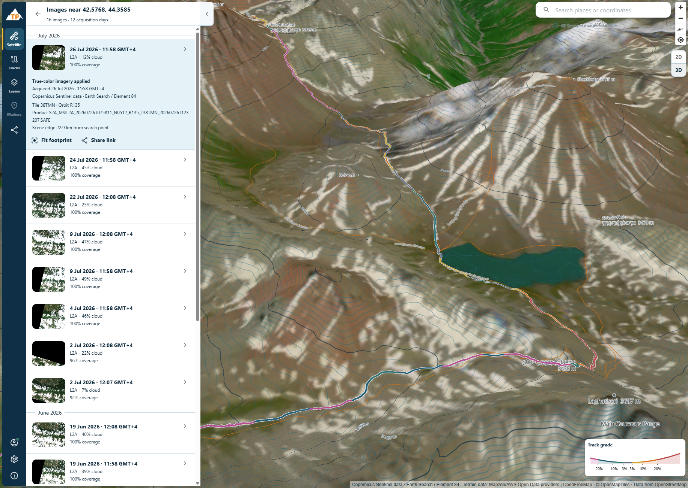
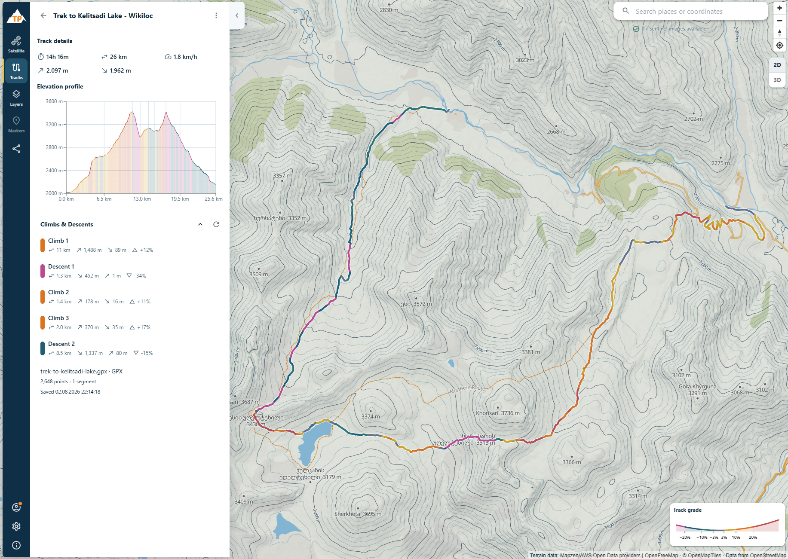

# Trail Planner

[Open Trail Planner](https://trail-planner.bogdandm.com/)

Trail Planner is a local-first web application for planning hiking trips by exploring
maps, inspecting terrain and satellite imagery, planning routes, and working with
personal tracks.

_This project was built 100% with LLMs._





## Features

- Explore a detailed hiking map in 2D or 3D with terrain, contours, and relief.
- Search for places or coordinates and inspect recent Sentinel-2 satellite imagery.
- Import GPX tracks with their root waypoints, plus FIT and KML tracks, directly in the
  browser.
- Plan multi-point routes over available roads and trails or add direct line segments.
- Review distance, duration, speed, ascent, descent, elevation profile, and route
  grades.
- Save, search, favorite, rename, reopen, delete, and download personal tracks.
- Save named map markers with custom icons and colors, then sort, edit, navigate to, or
  delete them.
- Choose which tracks, imagery, terrain, contours, and map details are visible.
- Optionally sign in and explicitly enable synchronization across devices.
- Share one ready synchronized track with a capability link; recipients need no account
  and can explicitly save an independent browser-local copy.

## Tracks

Drop a GPX, FIT, or KML file into the Tracks workspace or choose it from disk. Trail
Planner validates the file, displays the route on the map, and opens a detailed preview
before anything is saved.

Choose **Plan route** to open an unsaved route. Each map click adds the next waypoint.
The persistent **Next segment** control chooses whether the next leg follows available
road and trail topology or remains a direct line. Routing and elevation calculation run
in the browser; saving stores the result as an existing local track.

Saved tracks remain available after reopening the application. They can be searched,
favorited, renamed, deleted, or downloaded as GPX or KML. GPX waypoints stay attached to
their track as name-only markers and are included in GPX downloads.

When usable elevation is available, the track view adds:

- Distance, recorded duration, average speed, ascent, and descent.
- An interactive elevation profile linked to the highlighted map position.
- A climbs-and-descents breakdown.
- Grade colors along non-flat parts of the route.

## Markers

Place a marker from the Markers workspace or the map context menu. When a nearby point
of interest is available, Trail Planner suggests its name before saving. Choose from 117
Pinhead map icons grouped by category and ten colors; saved markers render on the map
and remain available after reopening the application.

Root GPX waypoints are imported as track-owned markers. The active editable track lists
them below elevation analysis, renders them as compact blue pins, and supports adding,
renaming, navigating to, and deleting them without adding them to the global marker
library. They persist and synchronize with the track.

The marker library sorts by creation time, name, color, or distance from the current map
area. Marker search, grouping, Satellite targeting, and copying global markers into a
manually created GPX route are not currently available.

## Maps and satellite imagery

The map combines hiking-focused OpenStreetMap data with relief, elevation contours, and
optional 3D terrain. Place and coordinate search moves directly to an area of interest,
while layer controls adjust map detail, terrain overlays, satellite imagery, and active
track visibility.

Layers offers an optional, browser-persisted Google satellite basemap alongside applied
Sentinel-2 scenes; the two raster products are mutually exclusive and either can be off.
The Satellite workspace searches recent Sentinel-2 scenes around the selected point.
Results show acquisition time, cloud cover, and scene coverage before true-color imagery
is applied to the map. The selected imagery remains aligned with terrain in both 2D and
3D.

## Local-first data

Saved imported and planned tracks, saved markers, and map preferences use browser
storage and remain available without an account.

Cross-device synchronization is optional and disabled by default. It starts only after
the user signs in and explicitly enables **Sync across devices**. Local track operations
remain available when synchronization is disabled or temporarily unavailable. Trail
Planner does not upload diagnostics or usage telemetry automatically.

Public track links require public Supabase configuration in the deployed build. Owners
must sign in and synchronize a track before sharing it; recipients do not need an
account. The `track-share` Edge Function requires a dedicated `TRACK_SHARE_TOKEN_SECRET`
in every environment before owner status and enable requests can reconstruct stable
links. Its value is exactly 32 random bytes encoded as unpadded base64url (43
characters); never print, commit, reuse between environments, or put it in `VITE_*`
configuration.

Generate and set it through the Edge Function secret store, replacing `<project-ref>`
with the target project:

```shell
secret="$(openssl rand -base64 32 | tr '+/' '-_' | tr -d '\n=')" && \
  ./node_modules/.bin/supabase secrets set --project-ref <project-ref> "TRACK_SHARE_TOKEN_SECRET=$secret" && \
  unset secret
```

## Limitations

- No offline map-region downloads.
- Routing, map, terrain, geocoding, and imagery features depend on public providers.
- Current desktop Google Chrome is the primary supported browser.

## Developer overview

Trail Planner is a static TypeScript application built with React, Vite, Material UI,
and MapLibre GL JS. IndexedDB stores local tracks, saved markers, and preferences, while
Supabase supports optional accounts and track synchronization. The production build is
deployed to GitHub Pages, and the core map, saved-marker, and local-track workflows do
not require an always-running application server.

### Local development

Prerequisites:

- Node.js `24.14.0`.
- pnpm `11.9.0`.
- Current stable desktop Google Chrome.

Install dependencies and start the development server:

```shell
pnpm install --frozen-lockfile
pnpm dev
```

Open the local URL printed by Vite. The default map, terrain, geocoding, and satellite
providers do not require credentials.

Account and synchronization features require:

- `VITE_SUPABASE_URL`
- `VITE_SUPABASE_PUBLISHABLE_KEY`

Without these variables, account and synchronization features remain unavailable while
local track functionality continues to work.

### Development commands

| Command                 | Purpose                                    |
| ----------------------- | ------------------------------------------ |
| `pnpm dev`              | Start the local development server.        |
| `pnpm test`             | Run unit and component tests.              |
| `pnpm test:integration` | Run adapter and persistence tests.         |
| `pnpm e2e`              | Run browser and accessibility checks.      |
| `pnpm build`            | Create the production build.               |
| `pnpm check`            | Run the complete non-browser verification. |

The complete command list is maintained in [`package.json`](./package.json).

### Documentation

- [Project documentation index](./docs/README.md)
- [Features and workspace UX](./docs/features.md)
- [UI design guidelines](./docs/ui-design.md)
- [Architecture and project structure](./docs/project-structure.md)
- [Map providers and attribution](./docs/map-providers.md)
- [Agent workflow and engineering conventions](./AGENTS.md)
