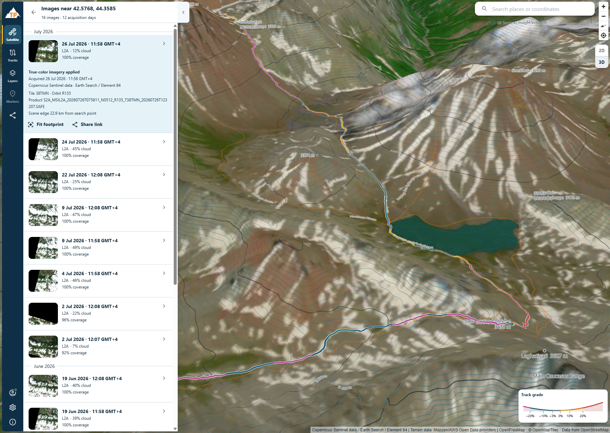
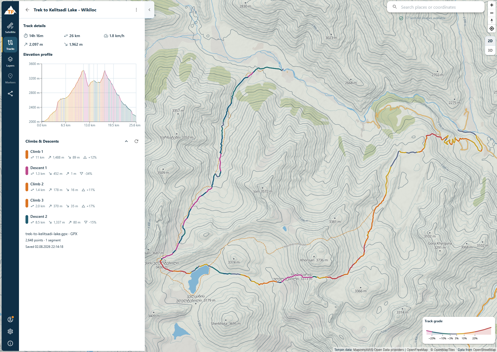

# Trail Planner

[Open Trail Planner](https://trail-planner.bogdandm.com/)

Trail Planner is a free browser app for planning hikes. Use it to explore terrain and
satellite imagery, draw or import a route, check the elevation profile, and see the
weather forecast. Nothing needs to be installed, and no account is required. Your tracks
and markers stay in your browser unless you turn on sync.

The map opens over Georgia (the country) and includes Georgian national orthophotos. The
map, routing, and weather also work in other regions.

_This project was built 100% with LLMs._





## What you can do

- **Explore the map.** Use a hiking map in 2D or 3D with relief shading and elevation
  contours. You can switch to Google, Bing, Esri, or Georgian NAPR aerial imagery, or
  find a recent Sentinel-2 satellite scene and filter by cloud cover.
- **Find places.** Search by name or coordinates. Right-click the map, or tap it on a
  phone, to see a point's elevation and nearby features. From there you can copy
  coordinates or a link, create a marker, search for satellite scenes, or open that
  point's weather forecast.
- **Work with tracks.** Import GPX, FIT, or KML files. You get distance, time, speed,
  ascent and descent, an interactive elevation profile, a list of climbs, and
  grade-colored route segments. You can view several tracks at once and download them as
  GPX or KML.
- **Plan routes.** Click waypoints on the map. Each segment either follows roads and
  trails or runs in a straight line. Routing and elevation calculations run in your
  browser.
- **Organize your library.** Name, search, sort, and favorite saved tracks, and sort
  them into folders. Each track shows a small shape preview, with loops colored
  differently.
- **Save places.** Add named markers with icons and colors. Markers can show the weather
  forecast for the days you choose, such as the coming weekend.
- **Check the weather.** Get a seven-day forecast for any point from the ECMWF model via
  Open-Meteo. A weather map shows clouds, precipitation, and wind over time. You can
  also open the same point on meteoblue or Windy.
- **Choose a language.** The app is available in English and Russian.

## Your data

- Tracks, markers, folders, and settings are saved in your browser and work without an
  account.
- Sync is optional and off by default. Sign in and turn on **Sync across devices** to
  keep tracks, folders, and markers the same on every device.
- A synced track can be shared with a link. People who open it do not need an account
  and can save their own copy.
- Trail Planner never uploads diagnostics or usage data automatically.

## Limitations

- An internet connection is required. Maps cannot be downloaded for offline use.
- Maps, terrain, search, imagery, and weather come from free public services and may
  sometimes be slow or unavailable.
- The weather is a model forecast, not a measurement from a weather station.
- The app is designed for current desktop Google Chrome. Phones get a dedicated layout,
  but other browsers are not officially supported.

## For developers

Trail Planner is a static TypeScript app built with React, Vite, Material UI, and
MapLibre GL JS, and is deployed to GitHub Pages. Local data lives in IndexedDB. Optional
accounts, sync, and track sharing use Supabase.

### Local development

Requirements: Node.js `24.14.0` and pnpm `11.9.0`.

```shell
pnpm install --frozen-lockfile
pnpm dev
```

The default map, terrain, search, imagery, and weather providers need no credentials.
Accounts and sync need `VITE_SUPABASE_URL` and `VITE_SUPABASE_PUBLISHABLE_KEY`. Without
them, everything else still works.

The `track-share` Edge Function requires a separate `TRACK_SHARE_TOKEN_SECRET` in each
environment. It must be exactly 32 random bytes, encoded as unpadded base64url. Never
commit or print it, and never reuse it or put it in `VITE_*` variables:

```shell
secret="$(openssl rand -base64 32 | tr '+/' '-_' | tr -d '\n=')" && \
  ./node_modules/.bin/supabase secrets set --project-ref <project-ref> "TRACK_SHARE_TOKEN_SECRET=$secret" && \
  unset secret
```

### Commands

| Command                 | Purpose                                              |
| ----------------------- | ---------------------------------------------------- |
| `pnpm dev`              | Start the development server.                        |
| `pnpm test`             | Run unit and component tests.                        |
| `pnpm test:integration` | Run adapter and persistence tests.                   |
| `pnpm e2e`              | Run Chromium and accessibility checks.               |
| `pnpm build`            | Type-check and create the production build.          |
| `pnpm check`            | Run the complete non-browser verification.           |
| `pnpm i18n:extract`     | Update translation catalogs from source messages.    |
| `pnpm i18n:check`       | Reject stale, malformed, or incomplete translations. |

The full list is in [`package.json`](./package.json).

### Documentation

- [Documentation index](./docs/README.md)
- [Features and workspace UX](./docs/features.md)
- [Architecture and project structure](./docs/project-structure.md)
- [Map providers and attribution](./docs/map-providers.md)
- [Agent workflow and engineering rules](./AGENTS.md)
