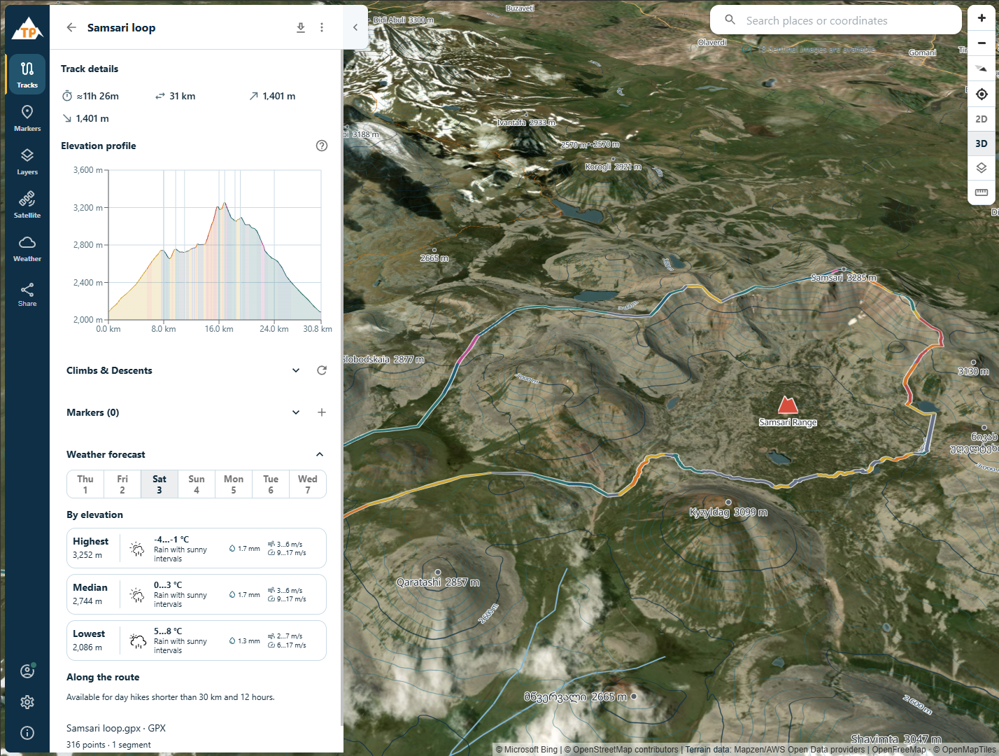
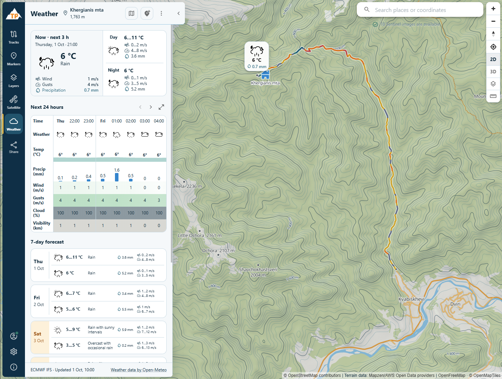
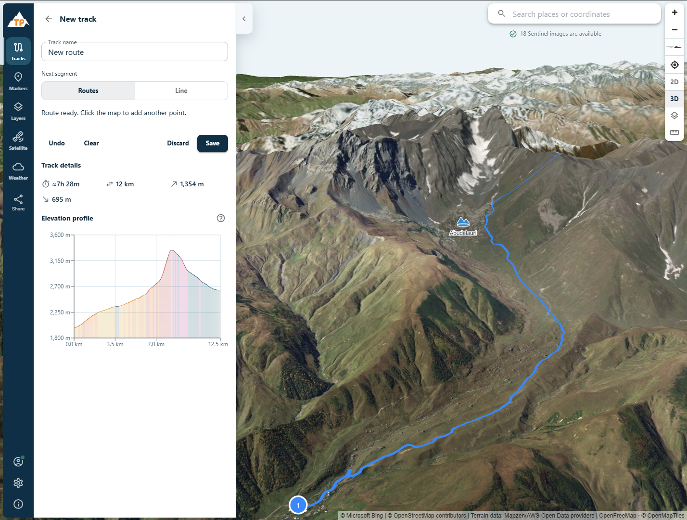

# Trail Planner

[Open Trail Planner](https://trail-planner.bogdandm.com/)

Trail Planner is a local-first web application for planning hiking trips. Use it to
explore maps, inspect terrain and satellite imagery, plan routes, and work with personal
tracks. It runs in the browser, needs no installation, and works without an account.

_This project was built 100% with LLMs._







## Features

- Explore a detailed hiking map in 2D or 3D with terrain, contours, and relief.
- Switch to Google, Bing, Esri, or Georgian NAPR aerial imagery, or apply a recent
  Sentinel-2 satellite scene.
- Search for places or coordinates. Right-click or tap any map point to copy it, share
  it, place a marker, search satellite imagery, or open its weather.
- Get a seven-day forecast for any point, and view clouds, precipitation, and wind on a
  weather map.
- Import GPX, FIT, and KML tracks, including GPX waypoints, directly in the browser.
- Plan multi-point routes that follow roads and trails, or add straight line segments.
- Review distance, duration, speed, ascent, descent, the elevation profile, and route
  grades.
- Save, search, sort, favorite, rename, and download personal tracks, and organize them
  in folders.
- Save named map markers with custom icons and colors, with optional weekend forecasts.
- Choose which tracks, imagery, terrain, contours, weather, and map details are visible.
- Use the interface in English or Russian, with a first-visit tour of each section.
- Optionally sign in and synchronize tracks, folders, and markers across devices.
- Share a synchronized track with a link. Recipients need no account.

## Tracks

Drop a GPX, FIT, or KML file into the Tracks workspace, or choose one from disk. Trail
Planner checks the file, shows the route on the map, and opens a detailed preview before
anything is saved.

Choose **Plan route** to start a new route. Each map click adds the next waypoint.
**Next segment** chooses whether the next leg follows roads and trails or runs as a
straight line. Routing and elevation are calculated in your browser, and the saved route
becomes an ordinary track.

Saved tracks remain available after you reopen the app. You can search, sort, favorite,
rename, delete, or download them as GPX or KML. Several tracks can be shown on the map
at once. Each saved track shows a small shape preview, and loops are colored
differently. Folders can be collapsed, and tracks without a folder are listed below
them. Tracks and folders can be moved with a mouse, touch, or the keyboard. GPX
waypoints stay attached to their track and are included in GPX downloads.

When elevation is available, the track view adds:

- Distance, recorded duration, average speed, ascent, and descent.
- An interactive elevation profile linked to the map.
- A breakdown of climbs and descents.
- Grade colors along the steeper parts of the route.

## Markers

Place a marker from the Markers workspace or from the map's point actions. When a named
place is nearby, Trail Planner suggests its name. Choose one of 130 map icons,
searchable and grouped by category, and one of ten colors. Recently used icons are
listed first.

The marker list sorts by creation time, name, color, icon, or distance from the current
map area. For each marker it can show the forecast for one or two chosen weekdays, with
Saturday and Sunday selected by default. The forecast can also appear on the map.

A GPX track's waypoints become markers that belong to that track. They appear when the
track is open and can be added, renamed, or deleted there without joining your main
marker list.

## Maps and satellite imagery

The map combines hiking-focused OpenStreetMap data with relief shading, elevation
contours, and optional 3D terrain. Search moves the map to a place or coordinate, and
Layers controls map detail, terrain overlays, imagery, weather, and track visibility.

You can use one aerial imagery basemap at a time: Google, Bing, Esri, or the Georgian
NAPR orthophoto. The Satellite workspace finds recent Sentinel-2 scenes and shows each
scene's acquisition time, cloud cover, and coverage before you apply it. Mosaic mode
combines several recent scenes to cover the visible area. Imagery stays aligned with the
terrain in both 2D and 3D.

## Weather

Choose **Select forecast point** in the Weather workspace, or pick **Show weather
forecast** from a map point. The sidebar then shows the next hours, a 24-hour table, and
seven daily summaries with separate day and night values for temperature, wind, gusts,
precipitation, and conditions. Links open the same point on meteoblue and Windy.

**Show weather map** draws clouds, precipitation, and wind arrows over the map for a
chosen forecast time. While it is on, each map click selects the forecast point. Relief
shading and contours are hidden until you turn it off.

Times follow the selected location's time zone. Forecasts come from the ECMWF IFS model
via Open-Meteo. They are model predictions, not weather-station measurements.

## Local-first data

Tracks, folders, markers, and preferences are saved in your browser. They remain
available without an account.

Synchronization across devices is optional and off by default. It starts only after you
sign in and turn on **Sync across devices**. Local work continues when sync is off or
temporarily unavailable.

A signed-in owner can share a synchronized track with a link. Recipients need no account
and can save their own copy in their browser. Trail Planner never uploads diagnostics or
usage data automatically.

## Limitations

- No offline map-region downloads.
- Routing, maps, terrain, search, imagery, and weather depend on public providers.
- Current desktop Google Chrome is the primary supported browser.

## Developer overview

Trail Planner is a static TypeScript application built with React, Vite, Material UI,
and MapLibre GL JS. IndexedDB stores local tracks, folders, markers, and preferences.
Supabase provides optional accounts, synchronization, and track sharing. The production
build is deployed to GitHub Pages, and the core workflows need no application server.

### Local development

Prerequisites:

- Node.js `24.14.0`.
- pnpm `11.9.0`.
- Current stable desktop Google Chrome.

Install dependencies and start the development server:

```shell
pnpm install --frozen-lockfile
pnpm dev
```

The default map, terrain, geocoding, satellite, and weather providers need no
credentials. Accounts and synchronization need:

- `VITE_SUPABASE_URL`
- `VITE_SUPABASE_PUBLISHABLE_KEY`

Without these variables, account and sync features are unavailable, and everything else
still works.

The `track-share` Edge Function requires a dedicated `TRACK_SHARE_TOKEN_SECRET` in every
environment. The value must be exactly 32 random bytes, encoded as unpadded base64url
(43 characters). Never print or commit it, never reuse it between environments, and
never put it in `VITE_*` configuration. Set it through the Edge Function secret store:

```shell
secret="$(openssl rand -base64 32 | tr '+/' '-_' | tr -d '\n=')" && \
  ./node_modules/.bin/supabase secrets set --project-ref <project-ref> "TRACK_SHARE_TOKEN_SECRET=$secret" && \
  unset secret
```

### Development commands

| Command                 | Purpose                                                     |
| ----------------------- | ----------------------------------------------------------- |
| `pnpm dev`              | Start the local development server.                         |
| `pnpm test`             | Run unit and component tests.                               |
| `pnpm test:integration` | Run adapter and persistence tests.                          |
| `pnpm e2e`              | Run browser and accessibility checks.                       |
| `pnpm build`            | Create the production build.                                |
| `pnpm check`            | Run the complete non-browser verification.                  |
| `pnpm i18n:extract`     | Update feature-split PO catalogs from source messages.      |
| `pnpm i18n:compile`     | Strictly compile catalogs into temporary validation output. |
| `pnpm i18n:check`       | Reject stale, malformed, incomplete, or drifting catalogs.  |

The complete command list is maintained in [`package.json`](./package.json).

### Documentation

- [Project documentation index](./docs/README.md)
- [Features and workspace UX](./docs/features.md)
- [UI design guidelines](./docs/ui-design.md)
- [Architecture and project structure](./docs/project-structure.md)
- [Map providers and attribution](./docs/map-providers.md)
- [Agent workflow and engineering conventions](./AGENTS.md)
