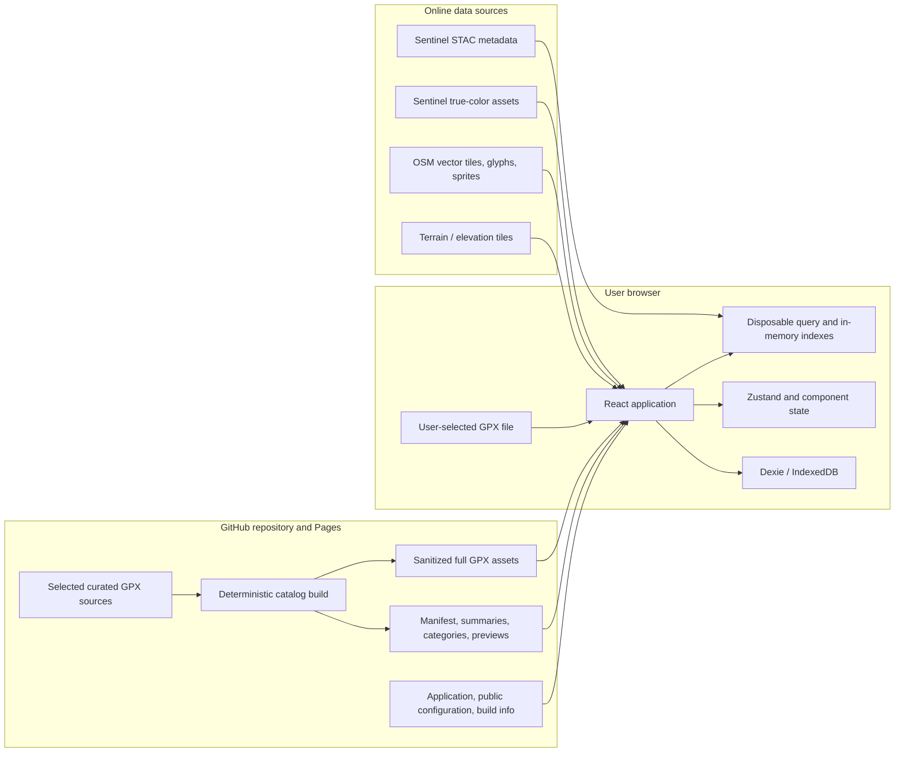
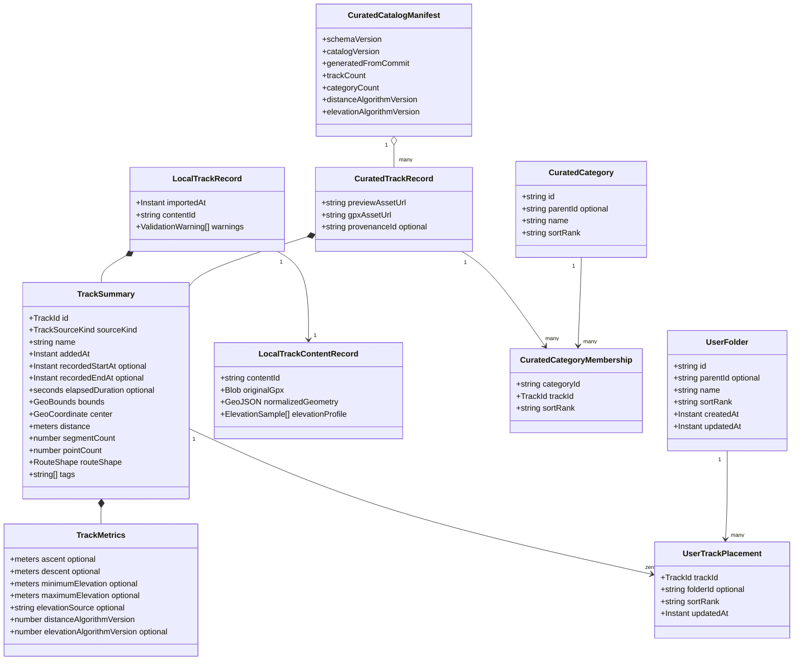
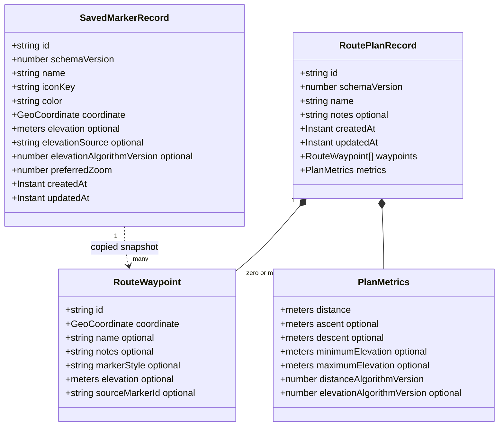
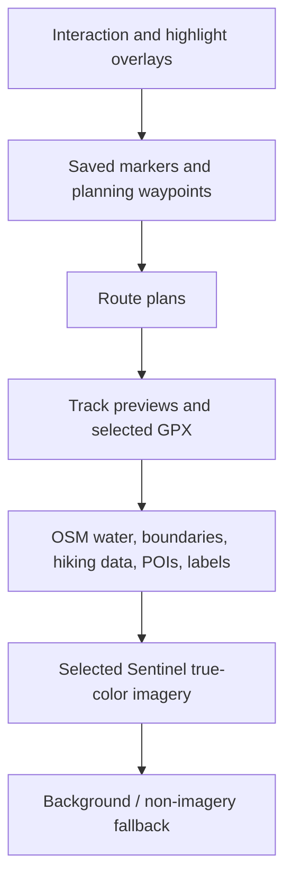
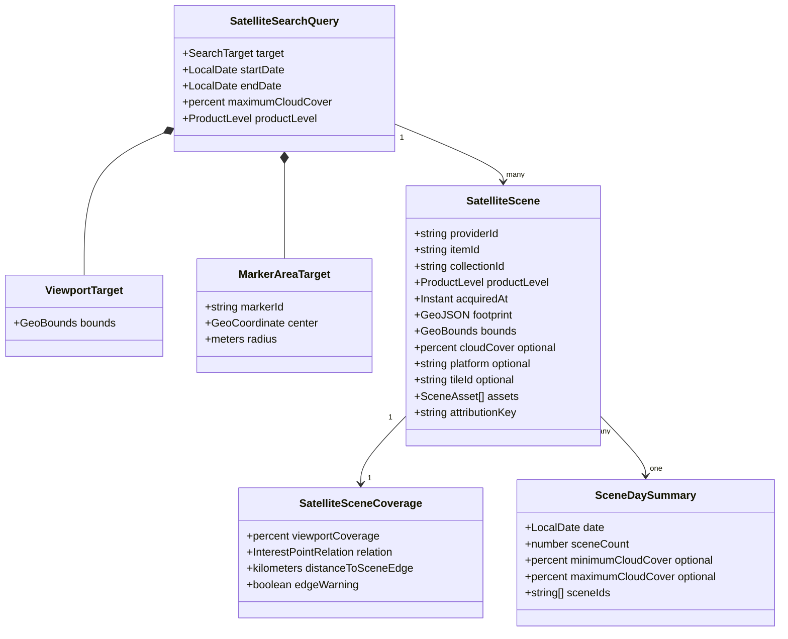

# Data model and storage ownership

## Scope and status

This document defines the target MVP data contracts and their authoritative storage. It
distinguishes the curated static GPX catalog from private browser-local data and from
provider-owned online data. The current database contains only settings and bounded
diagnostics. Other records in this document describe the complete system concept and do
not exist in IndexedDB until an executable schema and migration implement them.

Mermaid is the declarative schema language used here because it renders with the other
repository documentation. TypeScript types and Zod schemas become the executable
contracts when each feature is implemented.

## Ownership rules

1. The GitHub repository and its GitHub Pages output are authoritative for the curated
   catalog. The deployed application can read these assets but cannot edit them.
2. IndexedDB is authoritative for retained local tracks, personal folders, saved
   markers, route plans, and durable preferences. This data is not synchronized or
   uploaded.
3. STAC, imagery, OSM, and DEM providers are authoritative for online source data.
   Browser query/cache state is disposable and never becomes the source of truth.
4. Zustand and component state hold transient interaction and request state only.
   Provider adapters own only policy-required caches, such as Nominatim request pacing.
5. Derived statistics always record their algorithm and source versions. A version
   mismatch causes recalculation rather than silently mixing policies.
6. Every persisted or external record is validated at its boundary. Database schema and
   static catalog schema versions evolve independently.

## Storage inventory

| Data                                                                                                | Authority and location                                       | Client representation                                    | Retention/network rule                                                       |
| --------------------------------------------------------------------------------------------------- | ------------------------------------------------------------ | -------------------------------------------------------- | ---------------------------------------------------------------------------- |
| Curated source GPX and curation inputs                                                              | GitHub repository, `data/`                                   | Node catalog-tool input                                  | Only maintainer-selected files enter Git; never written by the app           |
| Curated catalog manifest, track summaries, categories, memberships, previews, and validation report | Generated GitHub Pages assets under `public/catalog/`        | Validated static queries and an in-memory viewport index | Versioned, read-only, fetched from the application origin                    |
| Curated full GPX                                                                                    | Generated GitHub Pages assets under `public/tracks/`         | Parsed only for an opened/downloaded track               | Loaded on demand; never all fetched at startup                               |
| Local GPX before retention                                                                          | Browser memory from a file picker or drop                    | Validated import preview                                 | Discarded unless the user explicitly retains it                              |
| Retained local track summary and content                                                            | Browser IndexedDB `localTracks` and `localTrackContents`     | `LocalTrackSummary` and `LocalTrackContent`              | Saved and deleted atomically; private to this browser                        |
| Personal folders and track placement                                                                | Browser IndexedDB                                            | Folder tree and one personal placement per track         | May reference curated or local track IDs; cannot modify static catalog files |
| Route plans and saved markers                                                                       | Browser IndexedDB                                            | Aggregate records mapped to domain objects               | Private until explicit GPX/file export                                       |
| Map camera and durable preferences                                                                  | Browser IndexedDB                                            | Validated settings records                               | Restore the last settled camera on next startup                              |
| Active selection, edit state, filters, sorting, layer instances                                     | Browser memory/Zustand/components                            | Serializable transient state plus map facade state       | Lost on reload unless a specific preference is deliberately persisted        |
| Static catalog cache                                                                                | Optional browser IndexedDB cache                             | Catalog data plus catalog version                        | Disposable; GitHub Pages manifest remains authoritative                      |
| Satellite search results and calendar summaries                                                     | Online STAC authority; component state in browser            | `SatelliteScene` and derived `SceneDaySummary`           | Cancellable and disposable; no bulk permanent mirror                         |
| Sentinel true-color imagery                                                                         | Online imagery provider                                      | Map raster source/texture                                | Requested for selected scenes; provider/browser cache policy applies         |
| OSM tiles, glyphs, and sprites                                                                      | Online configured map provider                               | MapLibre sources                                         | Provider-owned, attributed, and replaceable                                  |
| Terrain/elevation tiles                                                                             | Online configured DEM provider                               | MapLibre terrain and elevation adapter input             | Provider-owned; derived samples may be stored with plans/tracks/markers      |
| Diagnostics                                                                                         | Bounded browser memory and optional capped IndexedDB records | Typed diagnostic events and snapshots                    | Local-only; sanitized explicit export excludes geometry by default           |
| Build information and public provider configuration                                                 | GitHub Pages application bundle                              | Validated bootstrap values                               | Public by definition; secrets are forbidden                                  |

## Shared value types and conventions

| Type            | Contract                                                                       |
| --------------- | ------------------------------------------------------------------------------ |
| `TrackId`       | Namespaced stable string: `curated:<stable-id>` or `local:<uuid>`              |
| Other IDs       | UUID or another injected stable ID; never derived from a private local path    |
| `GeoCoordinate` | WGS84 longitude and latitude in GeoJSON order: `[longitude, latitude]`         |
| `GeoBounds`     | West, south, east, and north decimal degrees; validated and antimeridian-aware |
| Distance        | Integer or finite decimal meters; UI unit conversion is presentation-only      |
| Elevation       | Finite meters above the configured DEM datum, with provider/policy provenance  |
| Duration        | Non-negative elapsed seconds; absent when usable GPX timestamps do not exist   |
| Timestamps      | ISO 8601 UTC instants. Calendar grouping declares its display timezone         |
| Colors          | Validated theme/color token or normalized CSS hex value, never arbitrary CSS   |
| Versions        | Positive schema or algorithm version carried with the record it governs        |

## Track and catalog model

The application presents a combined catalog, but curated and local records retain
different authorities. `TrackSummary` is lightweight enough to load for every track.
Full GPX and full-resolution geometry are separate, on-demand content.

### Track attributes and invariants

| Record                    | Required attributes and rules                                                                                                                                            |
| ------------------------- | ------------------------------------------------------------------------------------------------------------------------------------------------------------------------ |
| `CuratedCatalogManifest`  | Static/catalog schema versions, content version, source commit, generated counts, calculation-policy versions, and asset references/checksums where useful               |
| `TrackSummary`            | ID, source kind, normalized non-empty name, added time, bounds, center, distance, point/segment counts, metrics, route shape, and tags; optional recorded times/duration |
| `TrackMetrics`            | Distance and optional ascent/descent/min/max elevation; every derived field is tied to its algorithm and elevation source version                                        |
| `CuratedTrackRecord`      | Summary plus relative same-origin preview and GPX asset URLs and optional approved provenance; URLs never expose source paths                                            |
| `LocalTrackRecord`        | Summary plus import time, content reference, and bounded validation warnings; `addedAt` equals the completed retention/import time                                       |
| `LocalTrackContentRecord` | Original retained GPX blob, validated normalized geometry, and optional cached elevation profile; fetched separately from summaries                                      |
| `CuratedCategory`         | Read-only hierarchical category from GitHub. A track may appear in multiple curated categories through memberships                                                       |
| `UserFolder`              | Browser-local hierarchical folder. Cycles are forbidden; sibling names need not be globally unique                                                                       |
| `UserTrackPlacement`      | Exactly one personal placement per track, with optional folder ID for `Unfiled` and a stable fractional/manual sort rank                                                 |

`recordedStartAt` and `recordedEndAt` come from valid GPX point timestamps.
`elapsedDuration` is their difference when the ordering is valid. Moving time is not an
MVP field because it requires a separate speed/stoppage policy. Curated curation may
omit sensitive timestamps while retaining a non-identifying duration. For curated
tracks, `addedAt` comes from reviewed curation metadata rather than the build clock; for
local tracks, it is the completed retention/import time.

The executable local-track schema keeps listable summaries separate from large geometry
and original GPX blobs. Both rows share the opaque local track ID. Saving and deleting
use one IndexedDB transaction, while rename updates only the validated summary. A
missing or invalid content row is surfaced as a bounded storage-integrity error; it
never becomes an empty geometry or a partially successful save.

Catalog search first intersects `GeoBounds` with the current viewport. Simplified
preview geometry can remove bounding-box false positives. An OSM-style tile index is not
part of the initial model for approximately 1,200 tracks; it may be added as a derived
static index without changing track identity if measurement justifies it.

## GPX parsing boundary

The same parser contract supports the Node catalog tool and browser imports, although
their file adapters differ. Untrusted XML never enters domain/application objects
without validation and resource limits.

| Result                 | Attributes                                                                                                                                  |
| ---------------------- | ------------------------------------------------------------------------------------------------------------------------------------------- |
| `GpxParseSuccess`      | Parsed tracks/routes/waypoints, normalized geometry, extracted name/times/elevation, point and segment counts, bounds, and bounded warnings |
| `GpxParseFailure`      | Stable error code, safe message, issue count, and bounded location/context that contains no raw file path or XML dump                       |
| `GpxValidationWarning` | Stable code, severity, affected segment/point index where safe, and remediation text                                                        |

Input limits cover XML size, nesting/entity behavior, coordinate ranges, segment and
point counts, non-finite values, and cancellation. Parsing never mutates a curated
source file or uploads a local file. The executable parser prefers renderable track
segments over companion route geometry, preserves independent segment boundaries, and
uses routes only when no renderable track segment exists.

Local import metrics are calculated once from normalized geometry. Distance uses
geodesic consecutive-point pairs within each segment; elevation gain and loss use only
adjacent pairs that both contain GPX elevation. Bounds retain an explicit antimeridian
crossing flag. Recorded duration is absent unless all rendered points have ordered,
valid timestamps. Each calculation stores its policy version so later policy changes
cannot silently reinterpret retained results.

## Plans, waypoints, and saved markers

A route plan is an aggregate stored as one versioned record because its ordered
waypoints and metrics must change atomically. Segments are derived between consecutive
waypoints and are not independently persisted. A saved marker and a plan waypoint have
separate identities; copying a marker into a plan records optional provenance but does
not create a live link.

`RoutePlanRecord`, “route plan”, and “plan” are domain/storage terms. In the approved UI
this aggregate is created and edited inside the Tracks-owned `Create GPX` workflow; it
does not imply a Plan tab, rail item, or separate top-level feature.

A persisted plan may remain an empty or one-point draft. Segments and non-zero route
metrics exist only when at least two waypoints are present. Deleting or editing a saved
marker never changes an existing route waypoint copied from it.

## Map state and extensible layers

Native MapLibre maps, sources, layers, event listeners, and workers are runtime objects
owned by the map facade. They are never persisted. Only validated serializable camera
and preference data crosses the storage boundary.

| Record                        | Storage                                               | Attributes                                                                                                                       |
| ----------------------------- | ----------------------------------------------------- | -------------------------------------------------------------------------------------------------------------------------------- |
| `MapCameraRecord`             | IndexedDB setting                                     | Longitude, latitude, zoom, bearing, pitch, schema version, and update time                                                       |
| `MapLayerDefinition`          | Application code/public configuration on GitHub Pages | Stable ID, layer kind, ordered band, adapter/source key, supported opacity/visibility controls, zoom limits, and attribution key |
| `MapLayerPreference`          | IndexedDB when persistence is useful                  | Layer ID, visibility, optional opacity, and update time                                                                          |
| `ActiveMapSelection`          | Session/Zustand                                       | Selected track/plan/marker/scene IDs and current interaction mode                                                                |
| Native map/source/layer state | Map facade memory                                     | Reconstructed from definitions, configuration, selections, and preferences                                                       |

Layer definitions occupy stable bands in this order:

The diagram is top-to-bottom visual priority. Terrain DEM is a capability/source used
for elevation and MapLibre terrain, not an ordinary visual overlay. The application
supports basic pitch and terrain but does not model richer 3D entities.

## Satellite, OSM, and elevation provider data

`SearchTarget` is exactly one viewport or marker-area variant. The implemented viewport
snapshot contains immutable WGS84 bounds and center. Product level is one exclusive
`L1C` or `L2A` value; a response containing the other level is rejected. Date endpoints
are inclusive UTC dates. A marker search uses an explicit radius; a point alone has no
meaningful intersection area. Calendar summaries and viewport coverage are derived from
returned scenes and are not persisted as authoritative data.

Scene identity is collection plus item ID. Search results are deduplicated on that key,
ordered by acquisition instant then item ID, and grouped by UTC date. Coverage is the
geodesic area intersection divided by submitted viewport area. The interest point is
classified as inside, boundary, or outside and carries its geodesic distance to the
nearest footprint ring. A visual asset is explicitly a renderable COG, unsupported JP2,
or unavailable; unsupported L1C imagery is never replaced with an L2A scene.

| Provider data             | Validated application attributes                                                                                                                       | Persistence                                                       |
| ------------------------- | ------------------------------------------------------------------------------------------------------------------------------------------------------ | ----------------------------------------------------------------- |
| STAC item                 | Provider/item/collection IDs, L1C/L2A level, acquisition instant, footprint, bounds, cloud cover, platform/tile IDs, approved asset links, attribution | Component state only                                              |
| Sentinel true-color asset | Scene ID, asset role/type, raster access URL/template, projection/resolution metadata needed by the adapter                                            | Runtime map source; provider/browser cache only                   |
| OSM vector source         | Provider/source ID, TileJSON/tile template, source-layer mapping, zoom range, glyph/sprite endpoints, attribution                                      | Public validated configuration plus runtime map source            |
| DEM source                | Provider/source ID, tile template, encoding, tile size, zoom range, attribution                                                                        | Public validated configuration plus runtime map/elevation adapter |
| Elevation sample          | Coordinate/distance-along-line, elevation meters or missing status, provider ID, and algorithm version                                                 | Derived profile cache or embedded metrics provenance              |

Selecting a date does not imply complete coverage. The MVP shows scene footprints and
requires an explicit scene selection instead of silently mosaicking all scenes on that
date. This can evolve behind the satellite gateway and raster adapter.

## Settings, caches, and diagnostics

| Record                  | Attributes and constraints                                                                                                                       |
| ----------------------- | ------------------------------------------------------------------------------------------------------------------------------------------------ |
| `UiPreferences`         | Schema version, developer-mode flag, and deliberately persisted presentation preferences; no authoritative feature data                          |
| `MapCameraRecord`       | Last settled validated camera and update time; corrupt values are removed and the Georgia default is used                                        |
| `CatalogCacheRecord`    | Catalog version, fetched time, and validated summaries/categories; fully disposable when versions differ                                         |
| `DiagnosticEvent`       | Schema version, timestamp/monotonic time, level, stable event name, subsystem, operation ID, allowlisted structured fields, and normalized error |
| `DiagnosticBufferState` | Capacity/retention bounds and optional recording-session boundary; diagnostic failure never blocks the primary operation                         |
| `BuildInfo`             | Application version, source commit, build time, and public configuration summary from the deployed bundle                                        |

Diagnostics do not become an alternate database for domain data. Raw GPX, complete
geometry, filenames, paths, free-form imported metadata, secrets, headers, and bodies
are excluded from default export. Geometry requires a separate explicit opt-in.

## Deletion and consistency rules

- Deleting a local track removes its content and personal placement atomically. It does
  not affect curated assets, folders, route plans, or saved markers.
- Removing a personal folder moves its placements to `Unfiled` unless the user chooses
  another explicit destination. Child-folder handling requires confirmation.
- Catalog-version replacement invalidates only derived/cache records, never user
  folders, placements, plans, markers, or local tracks.
- If a curated track disappears in a catalog update, its personal placement becomes an
  identifiable orphan that the UI can remove; it must not be rebound to another track by
  name.
- Updating a calculation policy marks affected cached metrics stale and recalculates
  them from authoritative geometry.
- All imports, searches, provider reads, long calculations, and file exports accept or
  propagate cancellation where the platform supports it.
