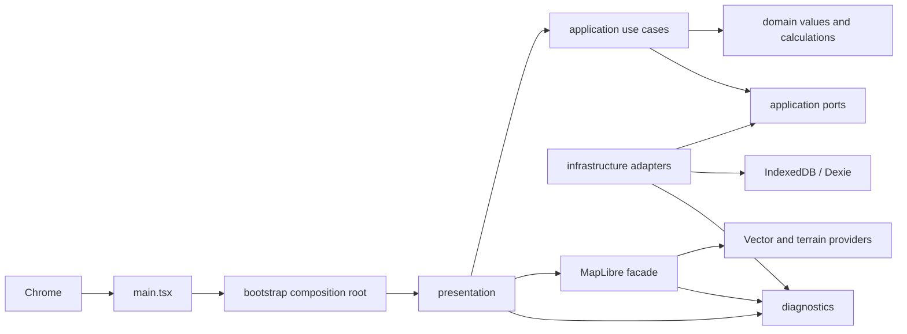

# Project structure

## System shape

The application is a static React client. GitHub Pages serves the build; the browser
talks directly to public map providers and stores durable local state in IndexedDB.
There is no application server, account, secret-bearing frontend configuration, or
automatic telemetry upload.



Dependencies point toward contracts: presentation and infrastructure may depend on
application ports; application code must not depend on React, MapLibre, Dexie, or MUI.
Any domain layer added to the repository must remain independent of all browser
frameworks.

## Repository layout

```text
src/
  main.tsx                 browser entry and provider nesting
  bootstrap/               one-time dependency construction and React service context
  domain/satellite/        framework-free Sentinel values and geometry calculations
  application/satellite/   cancellable Sentinel search and availability orchestration
  application/ports/       framework-free catalog, viewport, diagnostics, and storage ports
  infrastructure/          HTTP, STAC, elevation/satellite workers, IndexedDB, clock, and ID adapters
  diagnostics/             bounded logging, redaction, health, snapshots, and export
  presentation/
    shell/                 feature rail, contextual sidebars, settings, and shell state
    map/                   map UI, pure style, facade, terrain, and camera coordination
    layers/                logical visibility checkbox presentation
    satellite-browser/     live search controls and date-grouped scene presentation
    developer-tools/       local support and diagnostic UI
    theme/                 shared color tokens and Material UI theme
    styles/                application-level CSS
e2e/                       built-app Chromium workflows and provider fixtures
tests/                     unit, component, and integration tests mirroring `src/`, plus shared test support
tools/                     Node-only audit, diagnostics, and E2E runners
docs/                      maintainer-facing system documentation
```

The satellite domain contains readonly criteria, scene, coverage, and grouped-result
values plus deterministic Turf-backed coverage/edge calculations. The satellite
application layer validates submitted UTC criteria, enforces result bounds and product
separation, deduplicates scenes, and publishes correlated diagnostics through ports. It
does not import React, MapLibre, `ky`, or STAC JSON.

`infrastructure/stac/` owns the configured Earth Search adapter and Zod schemas. It
builds allowlisted STAC requests, validates all returned items before mapping them,
follows only same-origin POST pagination tokens within the configured cap, and converts
transport/schema failures to safe catalog errors. The composition root exposes the
adapter through named search and availability use cases; React never receives its `ky`
client. A serializable viewport snapshot store bridges settled map updates to Satellite
controls without exposing MapLibre.

`infrastructure/satellite/` owns direct visual-COG range decoding, UTM-to-Web Mercator
reprojection, and its validated worker RPC boundary. `SatelliteCogTileProvider`
registers one opaque MapLibre protocol and maps scene keys to validated asset URLs in
bounded memory. MapLibre source state contains only the opaque scene key; COG URLs stay
inside the provider and worker.

Satellite presentation uses the CC0-licensed `@photostructure/tz-lookup` data resolver
to map the submitted anchor coordinates to an IANA time zone entirely in the browser. No
location or acquisition metadata is sent to a time-zone service.

## Composition root

[`createRuntimeServices.ts`](../src/bootstrap/createRuntimeServices.ts) is the only
place that constructs runtime adapters. It creates the clock, ID generator, bounded
logger, Dexie database, camera repository, validated provider configuration, map
snapshot store, Sentinel query timeline store, HTTP client, health/diagnostics services,
and TanStack Query client.

[`main.tsx`](../src/main.tsx) installs global failure capture and nests providers in
this order: runtime services, TanStack Query, MUI theme, error boundary, workspace
shell. Tests replace the whole `RuntimeServices` object at the context boundary.

## State ownership

| State                                                     | Owner                                                      | Reason                                                  |
| --------------------------------------------------------- | ---------------------------------------------------------- | ------------------------------------------------------- |
| Dialogs, active rail section, developer flags             | Zustand `uiStore`                                          | Cross-component, transient, serializable UI state       |
| Component transitions and messages                        | React component state                                      | Local rendering concern                                 |
| Native map, listeners, camera snapshot, terrain operation | `MapLibreFacade`                                           | Imperative MapLibre lifecycle stays isolated            |
| Middle-drag orbit and terrain pivot marker                | `MiddleMouseCameraControl` / `MapLibreOrbitPivotIndicator` | Camera input and native marker placement stay isolated  |
| Sentinel and terrain-overlay sources/layer commands       | `MapLibreLayerController`                                  | Provider URLs and native resources stay imperative      |
| Direct visual-COG scene registry and raster worker        | `SatelliteCogTileProvider` / `SatelliteCogRasterizer`      | Bounded fallback state and COG URLs stay outside React  |
| DEM fetch, repair, parse, contour caches, worker fallback | `TerrainComputeEngine` / `TerrainComputeBackend`           | One algorithm runs in worker or inline compatibility    |
| Terrain worker execution status                           | `mapLayerStore`                                            | Transient serializable UI warning state                 |
| Visibility, stretch, rendering, and overlay preferences   | Dexie plus map layer controller                            | Durable non-scene choices with a serializable live view |
| Browser storage and optional heap measurements            | `BrowserStorageUsageReader`                                | Read-only platform metrics behind an app port           |
| Settled 2D center and zoom                                | Dexie through `MapCameraRepository`                        | Durable camera restarts without 3D orientation          |
| Map diagnostic snapshot                                   | `MapDiagnosticsSnapshotStore`                              | Serializable view shared by UI, health, and export      |
| Current/last Sentinel step status and duration            | `SentinelQueryDiagnosticsStore`                            | Memory-only live developer timeline                     |
| Submitted Sentinel criteria and derived grouped results   | `SatelliteBrowser` React state                             | Disposable, not persisted                               |
| Selected/applied Sentinel scene                           | `MapLibreLayerController` plus `mapLayerStore`             | Transient selection/rendering state, never persisted    |

Do not mirror authoritative map or durable data into Zustand. React consumes the map's
serializable snapshot through `useSyncExternalStore`; unrelated UI state must not cause
the native map instance to be recreated.

`WorkspaceShell` keeps the map fixed to the viewport and composes floating navigation.
`WorkspaceRail` owns the Tracks, Satellite, Markers, and Layers destinations plus global
Diagnostics and Settings actions. `WorkspaceSidebar` owns each section's implemented,
disabled, or empty presentation. Create GPX is currently a disabled Tracks action and is
never a rail section. Shared palette values live in `appColors.ts` so the MUI theme and
pure MapLibre style use the same visual vocabulary without introducing a second styling
system.

`BrowserStorageUsageReader` implements the small `StorageUsageReader` application port.
It combines the origin storage estimate, Chromium's optional per-category details,
localStorage byte estimation, and optional JavaScript heap counters without exposing
browser globals to the Settings UI. Missing browser capabilities produce unavailable
metric values rather than failing the dialog.

## Map boundary

[`MapWorkspace.tsx`](../src/presentation/map/MapWorkspace.tsx) translates React state
and user commands. [`MapLibreFacade.ts`](../src/presentation/map/MapLibreFacade.ts) owns
the native object, event listeners, terrain source, error aggregation, WebGL state, and
cleanup. [`mapStyleFactory.ts`](../src/presentation/map/mapStyleFactory.ts) is pure and
uses stable IDs from `mapIds.ts`. Any added feature layer must extend that typed
ordering instead of scattering MapLibre identifiers through presentation components.
`mapVisualPalette.ts` is the single owner of semantic map colors and vector/satellite
contrast paints; feature code must reference it instead of introducing local map-color
literals.

`TerrainComputeEngine` owns the `maplibre-contour` local manager and its bounded
filtered-PNG, parsed-DEM, and contour caches. `FilteredTerrariumTileProvider` uses
browser image/canvas primitives behind a typed codec, while `TerrariumDemFilter` owns
the pure rejection and replacement policy. `TerrainComputeConfiguration` is the narrow,
versioned worker DTO; one Zod schema defines its boundary and an explicit mapper strips
provider identity, attribution, overlay presentation, and other non-compute fields from
the validated application configuration. `WorkerTerrainComputeBackend` normally runs the
engine in one Vite module worker through the reusable request-correlated `WorkerRpc`
transport. A failed worker is restarted once; a second transport failure selects
`InlineTerrainComputeBackend`, which calls the same engine and exposes only a
serializable compatibility and bounded-queue state. Worker objects and caches never
enter React, Zustand, or application ports.

The application backend exposes only DEM and contour delivery. A private
`TerrainComputeManagerAdapter` satisfies the larger third-party manager shape without
advertising parsed-DEM access as an application capability. Parsed DEM data remains
internal to the engine and its contour cache. Worker diagnostics enter the injected
diagnostic logger directly; UI and export consumers read the diagnostics service rather
than subscribing through a terrain-specific bypass.

`MapLibreLayerController` attaches to the same native map through the facade and owns
Sentinel raster slots, the footprint, shared DEM relief, generated-contour source and
layers, and allowlisted logical visibility commands. `ContourTileGenerator` wraps the
MapLibre protocol that turns bounded DEM tile requests into vector contours; it does not
expose caches, provider URLs, or the native map to React. The facade forwards camera
movement state through the controller so the worker can prioritize DEM requests and
defer new contour calculations until movement settles. It also forwards the worker's
coordinate-free active and queued counts into the map-layer store for the operational
status line. The controller validates persistent imagery mode/tuning and terrain-overlay
preferences, atomically updates source tiles, and reconciles native order after style or
satellite changes. Satellite, Layers, and Settings consume its serializable Zustand
snapshot, so the duplicated render-mode control remains synchronized. Search results
remain local React state in a mounted-but-hidden Satellite browser so rail navigation
does not reset the session.

`SatelliteCogTileProvider` owns the `georgia-satellite-cog` MapLibre protocol and one
module worker. The provider retains at most two scene definitions, while the worker
retains at most two corresponding GeoTIFF readers. `geotiff` performs bounded HTTP range
reads and overview selection; `proj4` transforms each output pixel between WGS84 and the
validated northern-UTM scene CRS. The controller persists the Auto, Server, or Direct
rendering mode. Auto switches an existing raster source to this opaque protocol when the
hosted renderer reports 429 or the browser exposes the response as status zero because
CORS hid it; Direct starts on the protocol immediately, and Server does not switch. The
worker preserves the provider's pre-rendered 8-bit RGB values and does not apply the
hosted renderer's stretch controls. Raster readiness has no application deadline.

The same facade implements the narrow `MapViewportProvider` capability. It returns a
copy of current WGS84 bounds and center or `null` before a native map exists. Sentinel
validation rejects non-finite, inverted, antimeridian-crossing, or center-mismatched
snapshots; exact bounds never enter the default diagnostics bundle.
