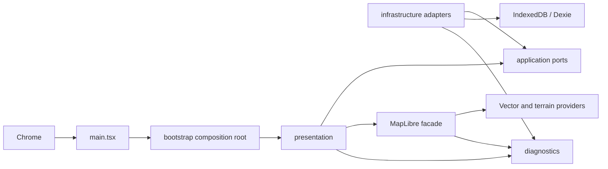

# Project structure

## System shape

The application is a static React client. GitHub Pages serves the build; the browser
talks directly to public map providers and stores durable local state in IndexedDB.
There is no application server, account, secret-bearing frontend configuration, or
automatic telemetry upload.



Dependencies point toward contracts: presentation and infrastructure may depend on
application ports; application code must not depend on React, MapLibre, Dexie, or MUI.
Any domain layer added to the repository must remain independent of all browser
frameworks.

## Repository layout

```text
src/
  main.tsx                 browser entry and provider nesting
  bootstrap/               one-time dependency construction and React service context
  application/ports/       framework-free capability contracts and shared values
  infrastructure/          HTTP, IndexedDB, clock, and ID implementations
  diagnostics/             bounded logging, redaction, health, snapshots, and export
  presentation/
    shell/                 feature rail, contextual sidebars, settings, and shell state
    map/                   map UI, pure style, facade, terrain, and camera coordination
    developer-tools/       local support and diagnostic UI
    theme/                 shared color tokens and Material UI theme
    styles/                application-level CSS
e2e/                       built-app Chromium workflows and provider fixtures
test/                      shared fixtures, fakes, setup, and repository-policy tests
tools/                     Node-only audit, diagnostics, and E2E runners
docs/                      maintainer-facing system documentation
```

`domain/` and feature use-case folders are not present. The current application layer
contains capability ports used by the implemented map, diagnostics, and persistence
boundaries.

## Composition root

[`createRuntimeServices.ts`](../src/bootstrap/createRuntimeServices.ts) is the only
place that constructs runtime adapters. It creates the clock, ID generator, bounded
logger, Dexie database, camera repository, validated provider configuration, map
snapshot store, Sentinel query timeline store, HTTP client, health/diagnostics services,
and TanStack Query client.

[`main.tsx`](../src/main.tsx) installs global failure capture and nests providers in
this order: runtime services, TanStack Query, MUI theme, error boundary, workspace
shell. Tests replace the whole `RuntimeServices` object at the context boundary.

## State ownership

| State                                                     | Owner                               | Reason                                             |
| --------------------------------------------------------- | ----------------------------------- | -------------------------------------------------- |
| Dialogs, active rail section, developer flags             | Zustand `uiStore`                   | Cross-component, transient, serializable UI state  |
| Component transitions and messages                        | React component state               | Local rendering concern                            |
| Native map, listeners, camera snapshot, terrain operation | `MapLibreFacade`                    | Imperative MapLibre lifecycle stays isolated       |
| Settled camera                                            | Dexie through `MapCameraRepository` | Durable local state                                |
| Map diagnostic snapshot                                   | `MapDiagnosticsSnapshotStore`       | Serializable view shared by UI, health, and export |
| Current/last Sentinel step status and duration            | `SentinelQueryDiagnosticsStore`     | Memory-only live developer timeline                |

Do not mirror authoritative map or durable data into Zustand. React consumes the map's
serializable snapshot through `useSyncExternalStore`; unrelated UI state must not cause
the native map instance to be recreated.

`WorkspaceShell` only composes the persistent regions. `WorkspaceRail` owns the Tracks,
Satellite, Markers, and Layers destinations plus global Diagnostics and Settings
actions. `WorkspaceSidebar` owns each section's implemented, disabled, or empty
presentation. Create GPX is currently a disabled Tracks action and is never a rail
section. Shared palette values live in `appColors.ts` so the MUI theme and pure MapLibre
style use the same visual vocabulary without introducing a second styling system.

## Map boundary

[`MapWorkspace.tsx`](../src/presentation/map/MapWorkspace.tsx) translates React state
and user commands. [`MapLibreFacade.ts`](../src/presentation/map/MapLibreFacade.ts) owns
the native object, event listeners, terrain source, error aggregation, WebGL state, and
cleanup. [`mapStyleFactory.ts`](../src/presentation/map/mapStyleFactory.ts) is pure and
uses stable IDs from `mapIds.ts`. Any added feature layer must extend that typed
ordering instead of scattering MapLibre identifiers through presentation components.
