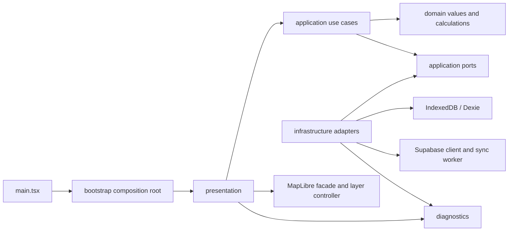

# Project structure

## System shape

The application is a static React client. GitHub Pages serves the build; the browser
talks directly to public map, search, imagery, and weather providers and stores durable
local state in IndexedDB. The project operates no application server. With valid public
Supabase configuration, a user may explicitly enable cross-device synchronization and
public track links through the `track-sync` and `track-share` Edge Functions under
`supabase/functions`. Frontend configuration contains no secrets, and diagnostics are
never uploaded automatically. The Vite development and preview servers send
`Cross-Origin-Opener-Policy: same-origin` and
`Cross-Origin-Embedder-Policy: require-corp`, so local runs are cross-origin isolated
([`vite.config.ts`](../vite.config.ts)).


```mermaid
flowchart LR
  Main["main.tsx"] --> Bootstrap["bootstrap composition root"]
  Bootstrap --> UI["presentation"]
  UI --> UseCases["application use cases"]
  UseCases --> Domain["domain values and calculations"]
  UseCases --> Ports["application ports"]
  Infra["infrastructure adapters"] --> Ports
  UI --> MapLibre["MapLibre facade and layer controller"]
  Infra --> IndexedDB["IndexedDB / Dexie"]
  Infra --> Supabase["Supabase client and sync worker"]
  UI --> Diagnostics["diagnostics"]
  Infra --> Diagnostics
```

Dependencies point toward contracts. `domain` and `application` import no React,
MapLibre, Dexie, MUI, `ky`, or other layers; presentation and infrastructure depend on
application ports. Only `bootstrap` constructs concrete adapters.

## Repository layout

```text
src/
  main.tsx                 browser entry, preference restore, and provider nesting
  bootstrap/               composition root, configuration validation, lifecycle
  domain/                  framework-free values: tracks, markers, satellite, weather,
                           elevation, and localization
  application/             use cases and ports: map search, satellite, tracks, user,
                           and weather
  infrastructure/          HTTP, STAC, geocoding, weather, persistence, Supabase, and
                           routing/elevation/satellite workers
  diagnostics/             bounded logging, redaction, health, snapshots, and export
  locales/{en,ru}/         feature-split Lingui PO catalogs
  presentation/
    shell/                 rail, contextual sidebar, settings, search, and UI store
    map/                   map workspace, facade, layer controller, style, and stores
    tracks/                import, folders, route planning, details, and sharing UI
    markers/               saved-marker library, editor, and marker weather
    layers/                basemap preset and logical visibility controls
    satellite-browser/     Sentinel scene and Mosaic search and rendering controls
    weather/               point forecast panel and weather-map time control
    user/                  account, synchronization, and remote-deletion UI
    localization/          shared Lingui instance and document metadata
    developer-tools/       diagnostics drawer and Sentinel query timeline
    theme/, styles/        color tokens, MUI theme, and global CSS
supabase/                  migrations, Edge Functions, and database/function tests
e2e/                       built-app Chromium workflows and provider fixtures
tests/                     unit, component, and integration tests mirroring `src/`
tools/                     Node-only audit, benchmark, diagnostics, E2E, localization,
                           and Supabase test runners
```

Vite runs Lingui macros and then the React Compiler over presentation code, so
components must stay compilable (pure render, no render-time mutation of refs or
stores).

## Composition root

[`createRuntimeServices.ts`](../src/bootstrap/createRuntimeServices.ts) is the only
place that constructs runtime adapters. It validates the map, geocoding, and Supabase
configuration, then creates the clock, ID generator, bounded logger, `AppDatabase`,
shared HTTP client, snapshot stores, layer controller with its contour and COG
protocols, trail router, filtered Terrarium and DEM elevation provider, weather use
case, place search, satellite search use cases, and health/diagnostics services. When
Supabase is configured it creates the official client with a persistent session plus
`SupabaseUserDataService` and `SupabaseTrackShareService`; otherwise it supplies an
unconfigured local-only user service and no share service. Invalid map configuration
leaves every map-dependent service `null`. `dispose()` releases the router, layer
controller, user service, and database.

[`main.tsx`](../src/main.tsx) runs inside `runApplicationBootstrap`, which mounts a
pre-React fallback if service construction fails. It restores UI preferences, resolves
and activates the locale before the first render, registers page-lifecycle disposal, and
nests `StrictMode`, Lingui, runtime services, the MUI theme, the error boundary, and
`WorkspaceShell`. Tests replace the whole `RuntimeServices` object at the context
boundary.

## Localization ownership

English is the source and fallback locale; Russian is the target locale.
[`lingui.config.ts`](../lingui.config.ts) defines eight catalog shards, each bound to
one source path: `core` (`main.tsx`, `presentation/localization`), `shell`, `map`,
`tracks`, `satellite` (`presentation/satellite-browser`), `markers`, `layers`, and
`user`. Code outside those paths, including `presentation/weather`, Developer
Diagnostics, and the pre-React bootstrap fallback, is not extracted.

`presentation/localization/appI18n.ts` owns the single Lingui instance, statically loads
every shard for both locales so switching works offline, and updates the document
language, title, and description on activation. `domain/localization/appLocale.ts` owns
the supported-locale type and the saved-preference/browser fallback rule. The explicit
choice persists in the `ui.preferences` record. Committed PO files are the only catalog
artifacts; merged validation output stays under `node_modules/.tmp/locales`, and
`tools/localization` owns catalog and source-string checks.

## State ownership

| State                                                       | Owner                                                           |
| ----------------------------------------------------------- | --------------------------------------------------------------- |
| Active rail section, dialogs, developer mode, list sorts    | Zustand `uiStore`                                               |
| Native map, listeners, camera snapshot, terrain operation   | `MapLibreFacade`                                                |
| Middle-drag pan and Shift+left terrain orbit                | `MapPointerGestureControl`                                      |
| Native sources/layers for imagery, terrain, weather, tracks | `MapLibreLayerController`                                       |
| Serializable layer, imagery, weather-map, and worker status | `mapLayerStore`                                                 |
| Map navigation, placement, Satellite anchor, Weather point  | `mapInteractionStore`                                           |
| Settled viewport for search controls                        | `MapViewportSnapshotStore`                                      |
| Direct visual-COG scene registry and raster worker          | `SatelliteCogTileProvider` / `SatelliteCogRasterizer`           |
| DEM fetch, repair, parse, contour caches, worker fallback   | `TerrainComputeEngine` / `TerrainComputeBackend`                |
| Tracks, folders, markers, camera, layer and UI preferences  | `AppDatabase` behind the application ports                      |
| Loaded folders, previews, route plan, selection, multi-view | `TracksWorkspaceProvider` React state                           |
| Marker collection, editor draft, per-marker forecasts       | `MarkersWorkspaceProvider` React state                          |
| Point-forecast request/result lifecycle                     | `WeatherPanel` React state                                      |
| Scene search results                                        | `SatelliteBrowser` React state                                  |
| Mosaic mode, dates, and request identity                    | `SatelliteMosaicProvider` React state                           |
| Map diagnostic snapshot / Sentinel query timeline           | `MapDiagnosticsSnapshotStore` / `SentinelQueryDiagnosticsStore` |
| Account session                                             | Official Supabase client via `UserDataService`                  |

Do not mirror authoritative map or durable data into Zustand. React reads map snapshots
through `useSyncExternalStore`; snapshots are new readonly values per update and must
not be mutated. Unrelated UI state must never recreate the native map.

`AppDatabase` implements `LocalTrackRepository`, `TrackFolderRepository`,
`SavedMarkerRepository`, `MapCameraRepository`, and `MapLayerPreferencesRepository`;
tracks and folders share it because placement, ordering, and sync state need one
transaction owner. See [data-model.md](data-model.md) for records and storage authority.

`WorkspaceShell` keeps the map fixed to the viewport. `WorkspaceRail` owns the Tracks,
Markers, Layers, Satellite, Weather, and User destinations plus Share, Diagnostics, and
Settings actions. `WorkspaceSidebar` keeps the Tracks, Satellite, and Weather panels
mounted while hidden so their sessions survive section changes. Shared palette values
live in `appColors.ts` for both the MUI theme and the MapLibre style.

## Workers

Four Vite module workers share the request-correlated `WorkerRpc` transport
(`infrastructure/runtime/WorkerRpc.ts`):

- `infrastructure/routing` — `BrowserTrailRouter` implements `TrailRouter`; the worker
  builds a request-local graph from the detail-vector `streets` layer and runs A*.
- `infrastructure/elevation` — `WorkerTerrainComputeBackend` runs `TerrainComputeEngine`
  (Terrarium repair, parsed DEM, `maplibre-contour`); `InlineTerrainComputeBackend` runs
  the same engine on the window thread after repeated worker failure.
  `TerrainComputeConfiguration` is the strict, versioned worker DTO.
- `infrastructure/satellite` — direct visual-COG range reads with `geotiff` and UTM to
  Web Mercator reprojection with `proj4`.
- `infrastructure/supabase` — `TrackSyncWorkerClient` runs synchronization in
  `trackSync.worker.ts`; the access token is its only remote credential.

Provider URLs, tile bytes, graphs, and caches never enter React or application ports.

## Map boundary

[`MapWorkspace.tsx`](../src/presentation/map/MapWorkspace.tsx) translates React state
and user commands, including the shared point actions.
[`MapLibreFacade.ts`](../src/presentation/map/MapLibreFacade.ts) owns the native object,
event listeners, error aggregation, WebGL state, point inspection, and cleanup. Its 3D
track fits use the pure pitched, terrain-aware camera solver in
[`directedCameraFit.ts`](../src/presentation/map/directedCameraFit.ts).
[`mapStyleFactory.ts`](../src/presentation/map/mapStyleFactory.ts) is pure and uses the
stable, typed IDs and insertion points in `mapIds.ts`; new layers extend that ordering
instead of scattering MapLibre identifiers. `mapVisualPalette.ts` is the single owner of
semantic map colors and vector/satellite contrast paints.

`MapLibreLayerController` attaches to the same native map through the facade. It owns
the basemap preset (`vector-osm`, Google, Bing, Esri, NAPR, or Sentinel-2), Sentinel
scene and Mosaic rasters, DEM relief and generated contours, the Open-Meteo weather
layers and `om://` protocol, track, route-plan, and marker overlays, and allowlisted
logical visibility commands. It validates and persists layer preferences and projects
its state into `mapLayerStore`. `ContourTileGenerator` registers the contour protocol
and adapts the terrain backend to `maplibre-contour`; `SatelliteCogTileProvider`
registers the `georgia-satellite-cog` protocol. Runtime behavior is described in
[runtime-flows.md](runtime-flows.md).

`BrowserStorageUsageReader` implements `StorageUsageReader` for Settings; missing
browser capabilities produce unavailable values rather than failing the dialog.
Satellite and Weather presentation resolve IANA time zones locally with
`@photostructure/tz-lookup`; no location is sent to a time-zone service.
