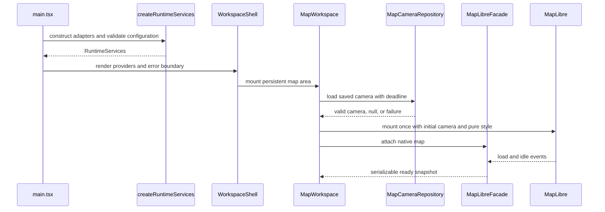
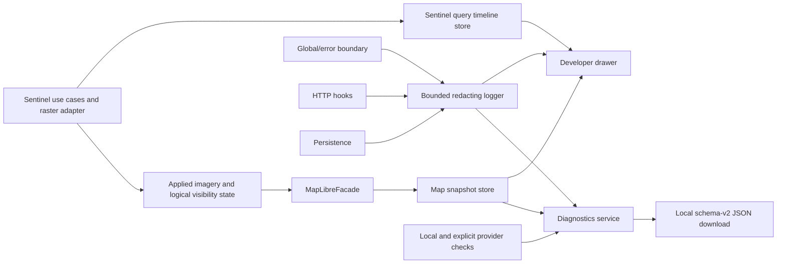
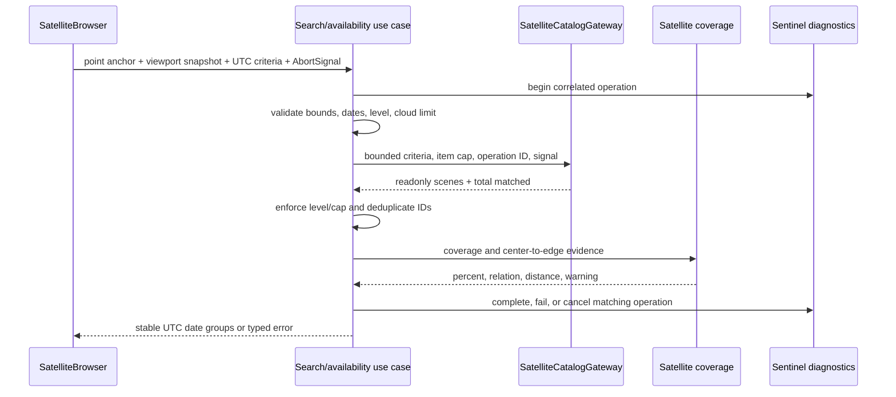

# Runtime flows

## Startup and map readiness



Configuration validation occurs before MapLibre mounts. A configuration failure renders
a fatal alert without contacting the provider. Camera failure is recoverable: the map
uses `defaultGeorgiaCamera`. The facade registers native listeners exactly once and
removes them during teardown.

The Satellite contextual sidebar subscribes to the existing serializable map snapshot
and shows the settled viewport center inside the compact `Viewport | <coordinates>`
selector. Viewport is the current source; Marker is visible but disabled until
saved-marker behavior exists. The sidebar never receives the native MapLibre object and
falls back to `defaultGeorgiaCamera` before the first snapshot is available.

Changing sections changes floating contextual content, not the full-viewport map owner
or its dimensions. Collapsing navigation keeps only the GR control above the map; that
control retains its expanded-state size and coordinates while the surrounding rail and
panes animate out. Opening Settings or Diagnostics follows the same invariant: the
existing `MapWorkspace` and native MapLibre instance stay mounted.

Settings is a non-modal floating dialog without a dimming backdrop. Releasing an imagery
stretch slider validates and stores the new numeric values, prepares a replacement
raster for the current scene, and swaps only after MapLibre reports it ready. A failed
tuning attempt rolls back the controller values and keeps the prior raster visible. At
startup, validated stretch preferences load before a saved Sentinel scene is restored.
When restoration reaches a ready or hidden state, Satellite projects the controller's
saved scene into a one-entry Images pane using the current viewport for coverage
evidence. Clicking that active entry aborts any pending application, removes both raster
slots and the footprint, clears the applied-scene preference, and returns map layer
state to empty.

Changing a terrain-overlay setting follows the same controller boundary. The controller
validates the supported contour interval, updates the generated vector-tile URL on the
existing source, reconciles relief/satellite/contour/OSM order, publishes a serializable
snapshot, and then persists the combined map-layer record. When no map is attached, it
persists the choice and applies it on the next style-ready attach. A failed native
update restores the previous preference and emits only a safe, bounded diagnostic
message.

Settings presents three exclusive tabs and mounts only the selected tab's content. The
Storage tab performs a fresh, read-only measurement when opened and on explicit refresh.
It combines `navigator.storage.estimate()`, optional Chromium usage details, a bounded
localStorage byte calculation, and optional `performance.memory` values. Unsupported or
failed measurements are omitted and do not block the rest of Settings.

Diagnostics opens as a non-modal persistent drawer. It neither installs a backdrop nor
captures interaction from the workspace, and it remains open until the user activates
its header close control, toggles the Diagnostics rail action, or disables developer
mode.

## Settled camera write

1. MapLibre emits `moveend`; the facade reads center, zoom, bearing, and pitch.
2. The facade updates its snapshot, notifies React, and calls the camera-settled port.
3. `SettledCameraPersistence` keeps only the newest camera during its debounce window.
4. Writes are chained so IndexedDB saves cannot overtake one another.
5. Save failure is logged and shown as a non-blocking warning; map interaction
   continues.

This flow intentionally excludes continuous `move`/render events from React, IndexedDB,
and diagnostics.

## Terrain transition

```mermaid
sequenceDiagram
  participant User
  participant UI as TerrainModeControl
  participant Facade as MapLibreFacade
  participant Map as MapLibre
  participant DEM as Terrain provider

  User->>UI: select 3D
  UI->>Facade: setTerrainMode(terrain)
  Facade->>Map: reuse controller-owned raster-dem source
  Facade->>Map: set terrain and preserve camera intent
  Map->>DEM: request configured DEM tiles
  alt source becomes ready
    Map-->>Facade: sourcedata loaded
    Facade-->>UI: success / terrain
  else error, timeout, or cancellation
    Facade->>Map: clear 3D terrain; retain shared overlay source
    Facade-->>UI: failed / usable flat map
  end
```

Only one terrain transition may run at a time. Repeated requests for the same target
share its promise; an opposite request receives an explicit failure. This prevents
duplicate sources, listeners, and out-of-order camera changes.

## Terrain overlay reconciliation

On style readiness, style data changes, satellite swaps, preference changes, and 3D
transitions, the layer controller idempotently restores the DEM source, relief shade,
generated contour source, minor/index lines, and index labels. The invariant is base
surface fills, relief/satellite in the selected order, contours, then OSM boundaries,
transport, and labels. This keeps terrain relief visible over grass, forest, and other
opaque land-cover fills. Updating the contour interval calls the existing vector
source's tile update, so the map camera and unrelated native resources remain untouched.
MapLibre abort signals flow through the contour protocol to bounded DEM requests; source
failures update the overlay snapshot without removing the basemap.

Applying, hiding, restoring, replacing, or clearing satellite imagery also reapplies the
shared visual mode on the existing native layers. Semantic colors remain stable, while
opaque vector-base land-cover fills switch off for satellite context, while true line
features, hillshade strength, and label halos update atomically; the map instance,
camera, sources, and user visibility choices are preserved. Surface polygons are not
restyled as decorative line layers; the restricted-area layer is an intentional red
perimeter derived from provider-tagged military geometry.

## Provider and WebGL failures

- `error` events are classified from safe source IDs and normalized messages.
- Style errors during startup become fatal because no usable basemap exists.
- Vector, glyph, and terrain errors update capped failure buckets and a degraded
  snapshot; repeated equivalent events do not create alert or log storms.
- The shell projects the latest degraded snapshot into the shared status below search;
  no separate recoverable map banner is mounted.
- `webglcontextlost` is prevented from default disposal, recorded as fatal, and exposed
  to the user. A restoration event refreshes capabilities and returns the snapshot to
  ready.

## Diagnostics and health



Logging is best-effort and must never fail the primary operation. Redaction happens
before an event enters the bounded buffer. Bundle creation copies serializable state,
coarsens camera location, and creates a local object URL that is revoked immediately
after download. Nothing is uploaded.

The shared `ky` client records start, completion, cancellation, timeout, HTTP-status,
and network-failure events. It exports only the remote origin, status, duration, and an
allowlisted operation ID; request paths, queries, headers, and bodies never enter the
diagnostic event. Satellite use cases pass their operation ID through the HTTP context
so application and transport events can be correlated without adding a public header.

Application startup is enclosed by a pre-React failure boundary. When normal runtime
services exist, the fallback can export the standard bundle. If service construction or
root discovery fails, it mounts against the available document body and produces a
minimal schema-versioned bootstrap bundle using the standalone redactor, without
depending on React, IndexedDB, health checks, or the normal diagnostics service.

Sentinel commands will open one timeline operation ID and publish a fixed sequence of
best-effort step transitions through the `SentinelQueryDiagnostics` application port.
The local store keeps only the current or most recent operation. While the persistent
drawer is open and the operation is running, its UI requests a monotonic-duration
refresh every 250 milliseconds; this performs no provider polling. Invalid or late
diagnostic transitions are ignored and cannot change the primary operation outcome.

## Sentinel search core

The Satellite sidebar invokes the provider-independent application flow and Earth Search
adapter through the injected `SearchSatelliteScenes` use case:



The Earth Search request intersects the immutable submitted center point, not the full
map bounds. The submitted viewport remains part of the application criteria only for
coverage calculation and edge evidence. The displayed UTC calendar month supplies the
date range; the current month ends at today and past months end on their final day.
Users do not enter date endpoints.

Each successful month is recorded as complete for the submitted viewport, product, and
cloud criteria, including a successful empty result. Calendar navigation checks that
session cache before requesting the displayed month. A missing month runs the same
cancellable search use case and appends its groups to the existing results. Revisiting a
complete month performs no provider request. Changing submitted criteria starts a new
session and clears the completed-month set.

The UI reveals locally loaded scenes in eight-card sets. When that result is exhausted,
the same load-more command finds the next missing month before the initially submitted
month, uses the immutable original viewport, product level, and cloud threshold, and
appends the returned groups. This continues back to the first Sentinel-2 archive month
without skipping a gap created by direct calendar navigation. Earth Search pages are
capped at 100 items and followed internally up to the configured ten-page safety
boundary, so a normal month is not truncated or turned into a user refinement task. The
use cases reject a mixed L1C/L2A response instead of substituting product levels. The
calendar's per-day cloud summary is a weighted average using each scene's submitted
viewport coverage as its weight, with a simple average fallback when every coverage is
zero. A newer operation replaces the visible timeline; late transitions from an older
request are ignored by operation ID. Logs contain correlation IDs, counts, durations,
and safe error codes, never exact viewport geometry.

The Earth Search gateway posts only allowlisted fields to the configured HTTPS search
URL. It obtains the first page, follows at most the configured number of same-origin
`POST` next tokens, validates every collected page with Zod, and then maps items to
readonly scenes. A page containing any malformed item fails as a whole; the application
does not present incomplete comparisons as trustworthy partial results. L1C `s3://`
visual keys are converted only for the known public bucket and remain marked as
unsupported JP2. L2A visual assets must be HTTPS true-color COGs.

Timeout, rate-limit, unsuccessful HTTP, network, schema, pagination, result-limit, and
cancellation outcomes remain distinct typed codes. Logs and the timeline contain the
operation ID, safe code, count, and duration only. Explicit provider health checks add a
fixed one-item Sentinel POST probe; startup never waits for it.

The sidebar captures one immutable viewport snapshot at submission, aborts a replaced
request, and keeps provider data local to the current browser session. Successful
results are grouped by UTC acquisition date. Catalog, pagination, validation, mapping,
and coverage steps complete in the live timeline. Applying a result starts a new
correlated operation for visual selection, provider reprojection, and MapLibre source
application.

## Sentinel imagery application and logical layers

```mermaid
sequenceDiagram
  participant User
  participant Browser as SatelliteBrowser
  participant Controller as MapLibreLayerController
  participant Renderer as Configured COG renderer
  participant Map as MapLibre
  participant State as Map layer store

  User->>Browser: click scene card or loaded calendar day
  Browser->>Controller: applyScene(scene, AbortSignal)
  Controller->>State: loading with safe scene key
  Controller->>Map: add hidden staging raster source/layer
    Map->>Renderer: request RGB tiles from raw red/green/blue COG bands
  alt staging source becomes ready
    Controller->>Map: reveal staging raster and update footprint GeoJSON
    Controller->>Map: remove prior raster source/layer
    Controller->>State: ready or hidden snapshot
  else source error, timeout, cancellation, or stale command
    Controller->>Map: remove staging resources only
    Controller->>State: failed/cancelled; prior raster remains usable
  end
```

Two internal raster slots make replacement atomic from the user's perspective. Provider
URLs remain inside the controller and never enter Zustand or exported diagnostics. The
footprint is updated only after the replacement raster is usable. `Fit footprint`
derives bounds from the validated polygon while preserving current pitch and bearing.

Layers commands use logical IDs. The Natural features command expands to land-cover,
glacier, and water-polygon layers; restricted-area, hiking, road, and place commands
expand to their fixed native style groups. Satellite and footprint commands target only
controller-owned layers. Adding a map data source includes adding its provider group and
relevant logical visibility controls to Layers in the same change. Visibility is applied
idempotently and projected into a serializable live store. Dexie persists visibility,
imagery stretch, and the last successful scene for startup restoration. Satellite
search/results state remains mounted while another rail section is visible, and
returning to Satellite reattaches the existing adjacent pane without a new provider
request.

## Teardown ownership

`MapWorkspace` flushes camera persistence and releases the native map through its ref
callback. The facade detaches the shared layer controller, cancels a pending terrain
wait, removes MapLibre and WebGL listeners, and releases the native map reference. Ref
cleanup preserves facade subscribers so React Strict Mode can immediately reattach the
retained facade without leaving map readiness or the Satellite controller stale. React
effects also remove online/offline listeners and reset developer-only debug flags. New
integrations must preserve this single-owner cleanup model.
