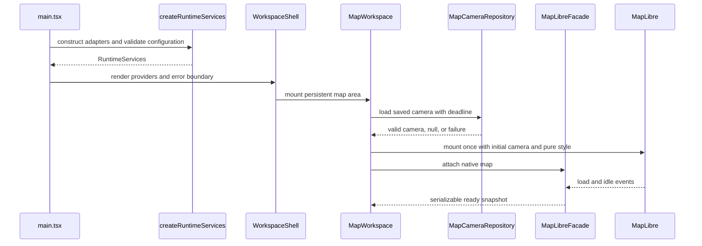
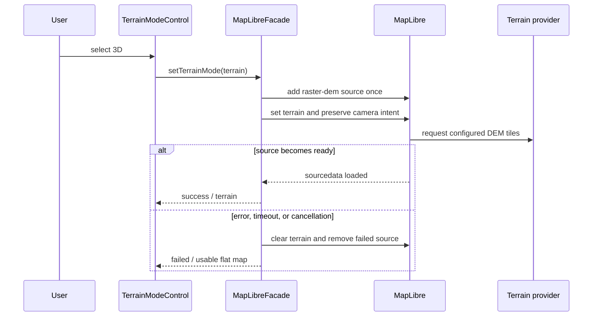
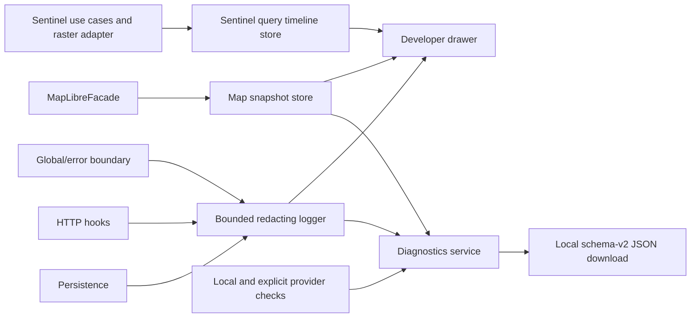
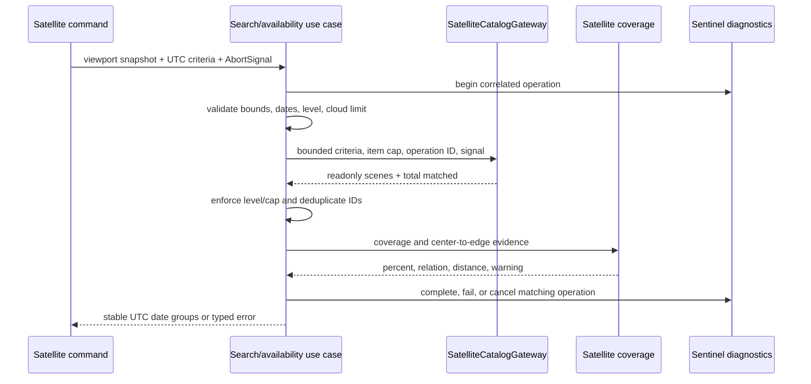

# Runtime flows

## Startup and map readiness

Configuration validation occurs before MapLibre mounts. A configuration failure renders
a fatal alert without contacting the provider. Camera failure is recoverable: the map
uses `defaultGeorgiaCamera`. The facade registers native listeners exactly once and
removes them during teardown.

The Satellite contextual sidebar subscribes to the existing serializable map snapshot
and shows the settled viewport center inside the compact `Viewport | <coordinates>`
selector. Viewport is the current source; Marker is visible but disabled until
saved-marker behavior exists. The sidebar never receives the native MapLibre object and
falls back to `defaultGeorgiaCamera` before the first snapshot is available.

Changing among Tracks, Satellite, Markers, and Layers changes contextual React content,
not the map owner. Opening Settings or Diagnostics follows the same invariant: the
existing `MapWorkspace` and native MapLibre instance stay mounted.

Diagnostics opens as a non-modal persistent drawer. It neither installs a backdrop nor
captures interaction from the workspace, and it remains open until the user activates
its header close control, toggles the Diagnostics rail action, or disables developer
mode.

## Settled camera write

1. MapLibre emits `moveend`; the facade reads center, zoom, bearing, and pitch.
2. The facade updates its snapshot, notifies React, and calls the camera-settled port.
3. `SettledCameraPersistence` keeps only the newest camera during its debounce window.
4. Writes are chained so IndexedDB saves cannot overtake one another.
5. Save failure is logged and shown as a non-blocking warning; map interaction
   continues.

This flow intentionally excludes continuous `move`/render events from React, IndexedDB,
and diagnostics.

## Terrain transition

Only one terrain transition may run at a time. Repeated requests for the same target
share its promise; an opposite request receives an explicit failure. This prevents
duplicate sources, listeners, and out-of-order camera changes.

## Provider and WebGL failures

- `error` events are classified from safe source IDs and normalized messages.
- Style errors during startup become fatal because no usable basemap exists.
- Vector, glyph, and terrain errors update capped failure buckets and a degraded
  snapshot; repeated equivalent events do not create alert or log storms.
- Retry triggers a repaint and clears the current warning without constructing a new
  map.
- `webglcontextlost` is prevented from default disposal, recorded as fatal, and exposed
  to the user. A restoration event refreshes capabilities and returns the snapshot to
  ready.

## Diagnostics and health

Logging is best-effort and must never fail the primary operation. Redaction happens
before an event enters the bounded buffer. Bundle creation copies serializable state,
coarsens camera location, and creates a local object URL that is revoked immediately
after download. Nothing is uploaded.

Sentinel commands will open one timeline operation ID and publish a fixed sequence of
best-effort step transitions through the `SentinelQueryDiagnostics` application port.
The local store keeps only the current or most recent operation. While the persistent
drawer is open and the operation is running, its UI requests a monotonic-duration
refresh every 250 milliseconds; this performs no provider polling. Invalid or late
diagnostic transitions are ignored and cannot change the primary operation outcome.

## Sentinel search core

The provider-independent application flow and Earth Search adapter are implemented even
though no search UI invokes them yet:

Date endpoints are inclusive and searches are limited to 62 days and 100 matched items.
The use cases reject a mixed L1C/L2A response instead of substituting product levels.
Availability uses the lowest scene-level cloud value as the per-day summary. A newer
operation replaces the visible timeline; late transitions from an older request are
ignored by operation ID. Logs contain correlation IDs, counts, durations, and safe error
codes, never exact viewport geometry.

The Earth Search gateway posts only allowlisted fields to the configured HTTPS search
URL. It obtains the first page, follows at most the configured number of same-origin
`POST` next tokens, validates every collected page with Zod, and then maps items to
readonly scenes. A page containing any malformed item fails as a whole; the application
does not present incomplete comparisons as trustworthy partial results. L1C `s3://`
visual keys are converted only for the known public bucket and remain marked as
unsupported JP2. L2A visual assets must be HTTPS true-color COGs.

Timeout, rate-limit, unsuccessful HTTP, network, schema, pagination, result-limit, and
cancellation outcomes remain distinct typed codes. Logs and the timeline contain the
operation ID, safe code, count, and duration only. Explicit provider health checks add a
fixed one-item Sentinel POST probe; startup never waits for it.

## Teardown ownership

`MapWorkspace` destroys the facade and flushes camera persistence. The facade cancels a
pending terrain wait, removes MapLibre and WebGL listeners, clears subscribers, and
releases the native map reference. React effects also remove online/offline listeners
and reset developer-only debug flags. New integrations must preserve this single-owner
cleanup model.
