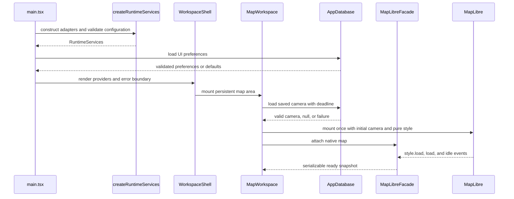
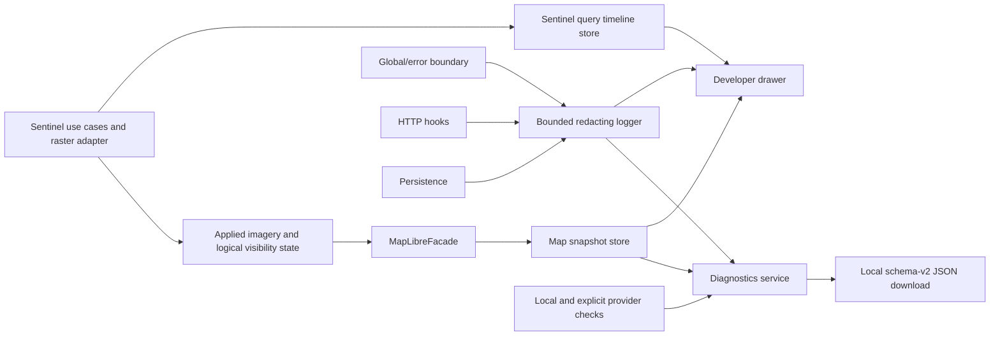
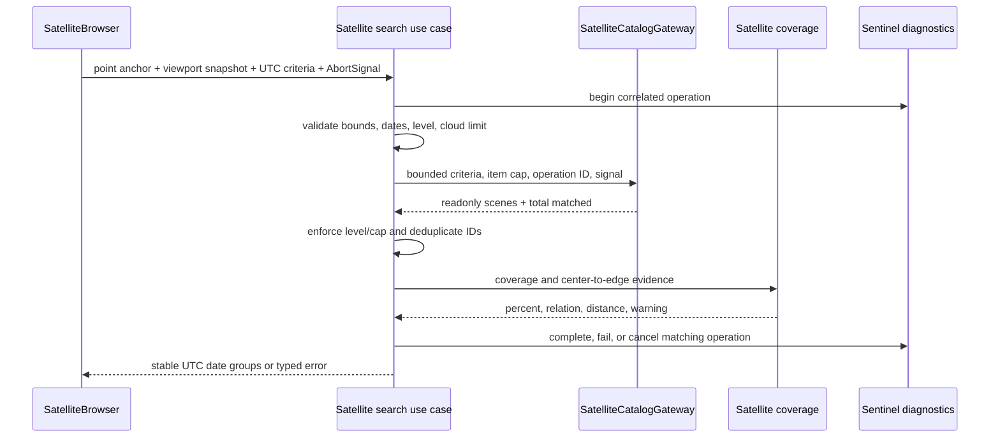

# Runtime flows

## Startup and map readiness



Configuration validation and UI preference restoration occur before React's first
render. This prevents the navigation from briefly rendering expanded when its persisted
state is collapsed. A storage failure logs a safe warning and uses default UI settings
without blocking startup. A configuration failure renders a fatal alert without
contacting the provider. Camera failure is recoverable: the map uses
`defaultGeorgiaCamera`. The facade publishes Ready on `style.load`, when MapLibre can
safely accept satellite and terrain sources, rather than waiting for every visible
basemap and relief tile. The later full `load` and `idle` events remain diagnostic
signals. The facade registers native listeners exactly once and removes them during
teardown.

The Satellite contextual sidebar subscribes to the existing serializable map snapshot
and shows the settled viewport center inside the compact `Viewport | <coordinates>`
selector. Viewport is the current source; Marker is visible but disabled until
saved-marker behavior exists. The sidebar never receives the native MapLibre object and
falls back to `defaultGeorgiaCamera` before the first snapshot is available.

Changing sections changes floating contextual content, not the full-viewport map owner
or its dimensions. Collapsing navigation keeps only the GR control above the map; that
control retains the blue logo's expanded-state size and coordinates while a white
chevron control travels with the retracting sidebar, docks at the logo's right edge, and
rotates to indicate expansion. Opening Settings or Diagnostics follows the same
invariant: the existing `MapWorkspace` and native MapLibre instance stay mounted. The
expanded GR mark and standalone chevron both collapse navigation; once collapsed, the
combined GR-and-chevron pill is one expansion target.

Settings is a non-modal floating dialog without a dimming backdrop. Releasing an imagery
stretch slider validates and stores the new numeric values, prepares a replacement
raster for the current scene, and swaps only after MapLibre reports it ready. A failed
tuning attempt rolls back the controller values and keeps the prior raster visible.
Startup restores only non-scene layer preferences. Late errors from a source that has
already been removed are ignored. Clicking the active scene aborts any pending
application, removes both raster slots and the footprint, clears the transient scene
selection, and returns map layer state to empty.

The persisted rendering mode selects the initial template: Auto and Server use the
hosted renderer, while Direct starts on the opaque COG protocol and never contacts
TiTiler. A newly selected scene first removes both raster slots and its predecessor's
footprint, then restores the vector basemap before adding the new source. The source is
not allowed to suppress the basemap until its first raster data event, so a slow hosted
request or automatic provider switch cannot blank the map.

An explicit HTTP 429 or status-zero/no-response failure does not refresh TiTiler. In
Auto mode, the controller changes that source to the direct visual-COG protocol and
continues waiting without an application deadline. It recreates the native raster source
and layer under the same stable IDs so MapLibre cannot retain hosted-renderer tiles or
released textures across the provider change; Server mode fails without switching. The
shell reports that TiTiler is unavailable while the alternative is switching and after
it becomes active. An explicit Direct selection, successful hosted render, or imagery
removal clears the automatic-fallback state. Retryable failures still use the bounded
failed-tile refresh policy, and usable partial imagery can be promoted after those
retries are exhausted.

Both mirrored rendering-mode controls remain enabled while staging. A mode command
persists the mode immediately, aborts the controller-owned application signal, removes
both provider raster slots, restores the vector style, and immediately reapplies the
same scene with the new initial template. Only one provider layer exists during this
transition. A later completion from the canceled operation cannot remove or overwrite
the replacement. MapLibre's final source-data event during removal is treated as
cancellation: it clears that source's recoverable failure and cannot leave the shared
status widget degraded.

After a raster is active, MapLibre tile errors flow through the facade for safe
classification and through the layer controller for recovery. The controller ignores
duplicate errors while a retry is scheduled, refreshes retryable failed raster tiles
after a bounded exponential delay, and stops after three attempts. HTTP 4xx failures,
including 429, status-zero/no-response failures, and unknown failures remain visible
without automatic retry. HTTP 429 and status zero open direct visual-imagery fallback
because a 429 response without CORS headers is indistinguishable from a connection
failure at the application boundary. A fresh raster source replaces the hosted source
under the same stable ID and uses an opaque custom protocol; a dedicated worker performs
bounded range reads of the pre-rendered 8-bit visual COG, UTM-to-Web Mercator
reprojection, and WebP encoding. It preserves the visual asset's channel values and
never applies hosted stretch tuning. A successful source-data event for every failed
canonical tile clears the controller's pending set; only then can a loaded source start
the two-second stability window. Another source error cancels that window. The facade
returns to ready when no active failure remains. Raw tile URLs, response bodies, and
tile coordinates never enter logs, React state, or the diagnostics bundle.

Changing a terrain-overlay setting follows the same controller boundary. The controller
validates the supported contour interval, updates the generated vector-tile URL on the
existing source, reconciles relief/satellite/contour/OSM order, publishes a serializable
snapshot, and then persists the combined map-layer record. When no map is attached, it
persists the choice and applies it on the next style-ready attach. A failed native
update restores the previous preference and emits only a safe, bounded diagnostic
message.

Settings presents three exclusive tabs and mounts only the selected tab's content. The
Storage tab performs a fresh, read-only measurement when opened and on explicit refresh.
It combines `navigator.storage.estimate()`, optional Chromium usage details, a bounded
localStorage byte calculation, and optional `performance.memory` values. Unsupported or
failed measurements are omitted and do not block the rest of Settings.

Diagnostics opens as a non-modal persistent drawer. It neither installs a backdrop nor
captures interaction from the workspace, and it remains open until the user activates
its header close control, toggles the Diagnostics rail action, or disables developer
mode.

## Settled map-view write and restore

1. Startup reads one versioned center-and-zoom value before mounting the map and forces
   bearing and pitch to zero.
2. An explicit 3D share URL restores its shared bearing and pitch and selects the 3D
   control immediately, but the first MapLibre style remains flat so optional DEM tiles
   cannot delay base-map readiness. Once the base map reports ready, terrain starts
   through the normal timeout and retry path. A user selecting 2D during initial loading
   supersedes the URL intent immediately; later readiness updates cannot re-enable
   terrain.
3. MapLibre emits `moveend`; the facade reads center, zoom, bearing, and pitch together
   with the current terrain mode.
4. The facade updates its snapshot, notifies React, and calls the view-settled port.
5. `SettledCameraPersistence` keeps only the newest serializable view during its
   debounce window, then passes only its camera to the repository. The repository writes
   center and zoom and discards orientation and terrain mode.
6. Writes are chained so IndexedDB saves cannot overtake one another.
7. Save failure is logged and shown as a non-blocking warning; map interaction
   continues.

This flow intentionally excludes continuous `move`/render events from React, IndexedDB,
and diagnostics.

For a shared satellite URL, `MapWorkspace` opens the Satellite section and resolves the
allowlisted collection/item identity without waiting for MapLibre readiness. The
controller publishes the selected scene to transient `mapLayerStore` state, so
`SatelliteBrowser` can open a one-card Images pane using footprint-derived coverage even
before a viewport snapshot exists. Native raster application and any shared 3D terrain
transition start separately as soon as the base style is ready for new sources.
Satellite, terrain, relief, and basemap tile loading can then proceed concurrently,
separating share navigation and selection from slower tile rendering while keeping all
scene data out of IndexedDB.

## Terrain transition

```mermaid
sequenceDiagram
  participant User
  participant UI as TerrainModeControl
  participant Facade as MapLibreFacade
  participant Map as MapLibre
  participant Filter as Filtered Terrarium protocol
  participant DEM as Terrain provider

  User->>UI: select 3D
  UI->>Facade: setTerrainMode(terrain)
  Facade->>Map: reuse controller-owned raster-dem source
  Facade->>Map: level camera and set terrain
  Map->>Filter: request shared raster-dem tile
  Filter->>DEM: fetch center and neighboring tile context
  Filter->>Filter: decode, reject, repair, re-encode, cache
  Filter-->>Map: corrected Terrarium PNG
  alt source becomes ready
    Map-->>Facade: sourcedata loaded
    Facade->>Map: apply the terrain camera from the loaded DEM
    Facade-->>UI: success / terrain
  else error, timeout, or cancellation
    Facade->>Map: clear 3D terrain; retain shared overlay source
    Facade-->>UI: failed / usable flat map
    loop two bounded backoff retries
      UI->>Facade: setTerrainMode(terrain)
      Facade->>Map: refresh shared DEM tiles and reapply terrain
    end
  end
```

Only one terrain transition may run at a time. Camera persistence ignores the internal
level-camera commands used during a transition. Entering 3D levels a restored pitched
flat camera before terrain changes its elevation reference, waits for the current DEM,
then applies and reads back MapLibre's terrain-safe camera. Leaving 3D levels the camera
before removing that elevation reference. Repeated requests for the same target share
its promise; an opposite request receives an explicit failure. This prevents duplicate
sources, listeners, and out-of-order camera changes. Selecting 2D also resets pitch and
bearing to zero, so the flat map returns north-up. The UI automatically retries a failed
3D enable twice with bounded backoff. Each retry advances a private source revision so
MapLibre does not reuse a failed tile-cache entry. If all attempts fail, the shared
status below search remains the only user-facing failure surface; no map banner is
mounted.

## Terrain overlay reconciliation

On style readiness, style data changes, satellite swaps, preference changes, and 3D
transitions, the layer controller idempotently restores the DEM source, relief shade,
generated contour source, minor/index lines, and index labels. The invariant is base
surface fills, relief/satellite in the selected order, waterways, contours, water-body
polygons, then OSM boundaries, transport, and labels. This keeps terrain relief visible
over grass, forest, and other opaque land-cover fills while water bodies mask generated
isolines. Updating the contour interval calls the existing vector source's tile update,
so the map camera and unrelated native resources remain untouched. MapLibre abort
signals flow through both the shared DEM and contour protocols, the request-correlated
worker channel, and the same filtered provider. The provider fetches the center and
eight neighbors concurrently under one timeout. Concurrent neighborhoods share in-flight
fetch and decode work for overlapping source tiles; canceling one consumer aborts that
source request only after its final consumer releases it. The provider applies the
configured pure repair policy and retains completed PNGs and decoded neighbor context in
bounded LRUs. Relief, 3D terrain, and generated isolines therefore cannot observe
different elevation bytes.

One dedicated module worker owns PNG decode/encode, repair, parsed DEM data, and contour
generation. Initialization maps validated provider configuration into the strict,
versioned compute DTO and validates that DTO at the worker boundary. Adding unrelated
provider or presentation fields therefore cannot invalidate worker startup. `movestart`
marks the channel interactive: DEM requests continue immediately while new contour
requests enter the bounded contour queue. Cancellation removes a queued request
immediately, a full queue cancels its oldest viewport request, and `moveend` drains
current contours one at a time. An already-running synchronous contour is allowed to
finish. Detach always clears interactive mode.

The worker publishes a coordinate-free queue snapshot whenever active work or the
contour backlog changes. The recoverable backend validates that event, the layer
controller stores only execution mode and counts, and the Ready status renders the
current queued count against the fixed capacity only while work is pending. Restart and
inline fallback reset the snapshot so stale worker work cannot remain visible.

Provider, timeout, decode, and compute errors fail only their request. A worker `error`,
`messageerror`, channel loss, or malformed DEM/contour result enters the same recovery
loop: one fresh worker receives the validated DTO plus current filter revision, then the
still-current request is retried. Cancellation remains cancellation and does not start
recovery. If the replacement worker also fails validation or transport, the page keeps
terrain available through the same engine on the window thread and publishes a
non-blocking compatibility warning. A later page session starts with a worker again.

The engine retains cached contour buffers. The worker server slices each cached result
and transfers that owned copy; inline compatibility slices before returning to MapLibre.
Protocol registration forwards those already-owned buffers directly, so no additional
window-thread copy is made and MapLibre detachment cannot corrupt later cache hits. DEM
protocol delivery is already owned because each response materializes a fresh buffer
from its `Blob`.

Queue/compute and end-to-end contour timings retain their separate event schemas. Each
aggregator uses the same small count/interval window, flushes partial batches during
runtime disposal, cancels its timer, and ignores later callbacks. Diagnostic logger
failures are contained and cannot fail terrain delivery. Aggregates exclude tile
coordinates, URLs, pixels, and geometry. Source failures update the overlay snapshot
without removing the basemap, while expected cancellation during source replacement is
ignored as lifecycle noise.

The persisted invalid-pixel repair preference defaults to enabled. Changing it clears
the shared protocol's processed, decoded, parsed DEM, and contour caches, then changes a
bounded revision on both native tile templates. MapLibre consequently reloads relief, 3D
terrain, and isolines together without remounting the map. Disabled mode preserves the
same shared protocol and cancellation/timeout behavior but fetches only the original
center PNG and bypasses decoding, neighborhood lookup, repair, and re-encoding.

Applying, hiding, restoring, replacing, or clearing satellite imagery also reapplies the
shared visual mode on the existing native layers. Semantic colors remain stable, while
opaque vector-base land-cover fills switch off for satellite context, while true line
features, hillshade strength, and label halos update atomically; the map instance,
camera, sources, and user visibility choices are preserved. Surface polygons are not
restyled as decorative line layers; the restricted-area layer is an intentional red
perimeter derived from provider-tagged military geometry.

## Provider and WebGL failures

- `error` events are classified from safe source IDs and normalized messages.
- Routine aborted, cancelled, and superseded tile requests are ignored before snapshot
  mutation or subscriber notification; camera movement must not create a render storm.
- Style errors during startup become fatal because no usable basemap exists.
- Vector, glyph, and terrain errors update capped failure buckets and a degraded
  snapshot; repeated equivalent events do not create alert or log storms.
- The shell projects the latest degraded snapshot into the shared status below search;
  no separate recoverable map banner is mounted.
- `webglcontextlost` is prevented from default disposal, recorded as fatal, and exposed
  to the user. A restoration event refreshes capabilities and returns the snapshot to
  ready.

## Diagnostics and health



Logging is best-effort and must never fail the primary operation. Redaction happens
before an event enters the bounded buffer. Bundle creation copies serializable state,
coarsens camera location, and creates a local object URL that is revoked immediately
after download. Nothing is uploaded.

The shared `ky` client records start, completion, cancellation, timeout, HTTP-status,
and network-failure events. It exports only the remote origin, status, duration, and an
allowlisted operation ID; request paths, queries, headers, and bodies never enter the
diagnostic event. Satellite use cases pass their operation ID through the HTTP context
so application and transport events can be correlated without adding a public header.

Application startup is enclosed by a pre-React failure boundary. When normal runtime
services exist, the fallback can export the standard bundle. If service construction or
root discovery fails, it mounts against the available document body and produces a
minimal schema-versioned bootstrap bundle using the standalone redactor, without
depending on React, IndexedDB, health checks, or the normal diagnostics service.

Sentinel commands will open one timeline operation ID and publish a fixed sequence of
best-effort step transitions through the `SentinelQueryDiagnostics` application port.
The local store keeps only the current or most recent operation. While the persistent
drawer is open and the operation is running, its UI requests a monotonic-duration
refresh every 250 milliseconds; this performs no provider polling. Invalid or late
diagnostic transitions are ignored and cannot change the primary operation outcome.

## Sentinel search core

The Satellite sidebar invokes the provider-independent application flow and Earth Search
adapter through the injected `SearchSatelliteScenes` use case:



The Earth Search request intersects the immutable submitted center point, not the full
map bounds. The submitted viewport remains part of the application criteria only for
coverage calculation and edge evidence. The displayed UTC calendar month supplies the
date range; the current month ends at today and past months end on their final day.
Users do not enter date endpoints.

Each successful month is recorded as complete for the submitted viewport and product,
including a successful empty result. Provider requests use the complete 0–100% cloud
range. The slider filters loaded scene cards client-side and updates the calendar's
orange highlights immediately. Acquisition dates above the threshold remain visible
without an outline, and changing the slider neither invalidates loaded months nor
performs another provider request. A calendar selection above the threshold remains in
the results projection while it is selected, so the active card can be inspected and
de-applied. Clearing that selection or selecting a different scene reapplies the cloud
filter. Calendar navigation checks the session cache before requesting the displayed
month. A missing month runs the same cancellable search use case and appends its groups
to the existing results. Revisiting a complete month performs no provider request.
Changing submitted provider criteria starts a new session and clears the completed-month
set.

The UI reveals locally loaded scenes in eight-card sets. When that result is exhausted,
the same load-more command finds the next missing month before the initially submitted
month, uses the immutable original viewport and product level with the complete cloud
range, and appends the returned groups. This continues back to the first Sentinel-2
archive month without skipping a gap created by direct calendar navigation. Earth Search
pages are capped at 100 items and followed internally up to the configured ten-page
safety boundary, so a normal month is not truncated or turned into a user refinement
task. The use cases reject a mixed L1C/L2A response instead of substituting product
levels. The calendar's per-day cloud summary is a weighted average using each scene's
submitted viewport coverage as its weight, with a simple average fallback when every
coverage is zero. A newer operation replaces the visible timeline; late transitions from
an older request are ignored by operation ID. Logs contain correlation IDs, counts,
durations, and safe error codes, never exact viewport geometry.

The Earth Search gateway posts only allowlisted fields to the configured HTTPS search
URL. It obtains the first page, follows at most the configured number of same-origin
`POST` next tokens, validates every collected page with Zod, and then maps items to
readonly scenes. A page containing any malformed item fails as a whole; the application
does not present incomplete comparisons as trustworthy partial results. L1C `s3://`
visual keys are converted only for the known public bucket and remain marked as
unsupported JP2. L2A visual assets must be HTTPS true-color COGs.

Timeout, rate-limit, unsuccessful HTTP, network, schema, pagination, result-limit, and
cancellation outcomes remain distinct typed codes. Logs and the timeline contain the
operation ID, safe code, count, and duration only. Explicit provider health checks add a
fixed one-item Sentinel POST probe; startup never waits for it.

The sidebar captures one immutable viewport snapshot at submission, aborts a replaced
request, and keeps provider data local to the current browser session. Successful
results are grouped by UTC acquisition date. Catalog, pagination, validation, mapping,
and coverage steps complete in the live timeline. Applying a result starts a new
correlated operation for visual selection, provider reprojection, and MapLibre source
application.

## Sentinel imagery application and logical layers

```mermaid
sequenceDiagram
  participant User
  participant Browser as SatelliteBrowser
  participant Controller as MapLibreLayerController
  participant Renderer as Configured COG renderer
  participant Worker as Direct visual-COG worker
  participant Map as MapLibre
  participant State as Map layer store

  User->>Browser: click scene card or loaded calendar day
  Browser->>Controller: applyScene(scene, AbortSignal)
  Controller->>State: loading with safe scene key
  Controller->>Map: add staging raster source/layer
  Map->>Renderer: request RGB tiles from raw red/green/blue COG bands
  alt Auto mode and renderer returns 429 or CORS-opaque status zero
    Controller->>Map: restore vector style and replace template with direct protocol
    Map->>Worker: request tile by safe scene key
    Worker->>Worker: range-read, reproject, and encode the 8-bit visual COG
    Worker-->>Map: reveal each completed WebP tile progressively
  end
  alt staging source becomes ready
    Controller->>Map: reveal raster and update footprint GeoJSON
    Controller->>State: ready or hidden snapshot
  else source error, cancellation, or stale command
    Controller->>Map: remove pending resources
    Controller->>State: failed/cancelled; vector basemap remains usable
  end
```

Two internal raster slots support stretch-tuning replacement. Rendering-mode and scene
changes remove both slots immediately, so two providers or scene selections cannot
remain overlaid. Provider URLs remain inside the controller and never enter Zustand or
exported diagnostics. The footprint is updated only after the replacement raster is
usable. `Fit footprint` derives bounds from the validated polygon while preserving
current pitch and bearing.

Layers commands use logical IDs. The Natural features command expands to land-cover,
glacier, and water-polygon layers; restricted-area, hiking, road, and place commands
expand to their fixed native style groups. Satellite and footprint commands target only
controller-owned layers. Adding a map data source includes adding its provider group and
relevant logical visibility controls to Layers in the same change. Visibility is applied
idempotently and projected into a serializable live store. The OpenStreetMap group
opacity scales the existing satellite-mode paint opacity for its controlled fills,
lines, points, and labels. Vector mode always uses the unscaled base paint. Dexie
persists visibility, shared OpenStreetMap opacity, rendering mode, imagery stretch, and
terrain-overlay preferences. Scene metadata stays transient and is never written to
Dexie. Satellite search/results state remains mounted while another rail section is
visible, and returning to Satellite reattaches the existing adjacent pane without a new
provider request.

## Place search expansion

`MapSearchPlaceholder` captures an immutable viewport with an explicit text submission.
`SearchPlaces` asks the replaceable gateway for results inside that area, accumulates
visually unique name-and-category matches in inner-to-outer order, and emits the growing
list after each response. This collapses OSM streets split across several ways while
preserving same-name features whose full location labels differ. It doubles the area
around the same center until the radius reaches 500 km even when an earlier area already
matched. Sub-metre cap tolerance and a defensive attempt ceiling guarantee the expansion
terminates even when floating-point bounds or a provider cache repeat an area. The
Nominatim adapter serializes the requests at no more than one per second, caches each
query-and-area combination, and passes cancellation through every wait and HTTP request.
Provider failure ends the search without discarding results that were already visible in
the component; a new submission or closing the result list cancels the obsolete query.
Map camera interactions do not close the list and therefore do not cancel the query. The
adapter also maps provider categories into settlements, administrative areas, mountains,
water, and other results. Presentation prioritizes the first four groups and hides the
other group until explicitly requested. Each displayed match includes its geodesic
distance from the original viewport center; later camera movement does not change that
search anchor. Only explicit settlement types are classified as settlements, so objects
such as `place=square` remain in the optional other-results group.

## Point inspection lifecycle

`MapLibreFacade` owns the serializable inspection state and the native popup adapter.
The first map click opens loading state and starts cancellable POI/elevation work. If an
inspection is already open and intersects the map viewport, the next map click closes
it, aborts that work, and does not inspect the new coordinate; the following click may
start another inspection. An entirely offscreen popup is closed and replaced by the same
click. Sequence checks prevent a late provider result from reopening a closed popup.
Explicit popup close uses the same cancellation path. Diagnostics record only lifecycle,
duration, outcome, and result count, never the clicked coordinate or arbitrary POI
metadata.

## Local track retention

A picker selection or full-workspace drop switches to Tracks and parses one `.gpx` file
in memory. Another import, selecting a saved track, or closing the preview first
requires an explicit discard decision. A valid preview starts a cancellable optional
English-name lookup without blocking editing or save. Switching rail sections retains
the preview. `beforeunload` is registered only while that preview remains unsaved and is
removed after save or confirmed discard.

Saving a validated import writes its lightweight summary and full content row in one
Dexie read-write transaction. The summary contains the stable display and derived
metrics used by list views; the content row contains normalized independent segments and
the retained original GPX blob. A transaction failure leaves neither row listable.
Rename validates and changes only the summary. Delete removes both rows in one
transaction. Opening a saved track validates its content independently and reports a
bounded integrity error when the row is missing or corrupt.

## Teardown ownership

`MapWorkspace` flushes camera persistence and releases the native map through its ref
callback. The facade detaches the shared layer controller, cancels a pending terrain
wait, removes MapLibre and WebGL listeners, and releases the native map reference. Ref
cleanup preserves facade subscribers so React Strict Mode can immediately reattach the
retained facade without leaving map readiness or the Satellite controller stale. React
effects also remove online/offline listeners and reset developer-only debug flags. New
integrations must preserve this single-owner cleanup model.

For final page teardown or Vite module replacement, runtime-service disposal removes the
registered DEM/contour protocols, releases terrain timing subscriptions, flushes partial
diagnostic batches, terminates the terrain worker, rejects pending RPC work, clears
worker caches, detaches controller listeners, and closes local runtime resources. A page
retained in Chrome's back-forward cache keeps its runtime and `pagehide` listener
intact. After restoration, a later final navigation removes that listener and disposes
the runtime; Vite module replacement uses the same explicit, idempotent cleanup path.
