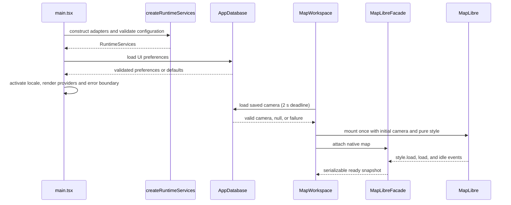
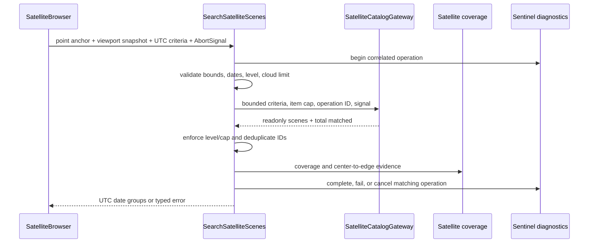
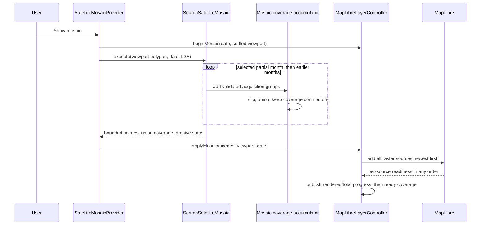
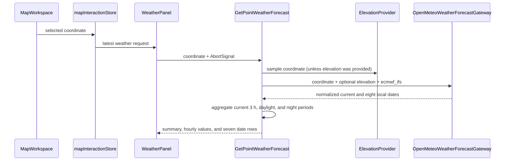
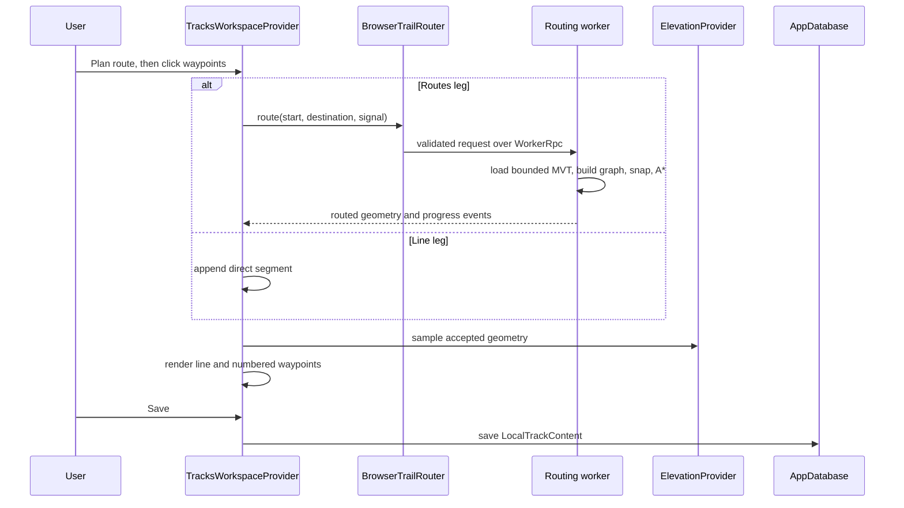
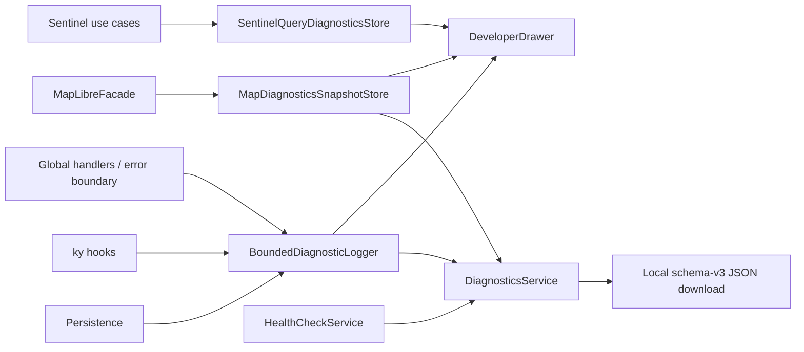

# Runtime flows

Module owners are listed in [project-structure.md](project-structure.md); persisted
records in [data-model.md](data-model.md); user-visible behavior in
[features.md](features.md).

## Startup and map readiness

```mermaid
sequenceDiagram
  participant Entry as main.tsx
  participant Root as createRuntimeServices
  participant Storage as AppDatabase
  participant Workspace as MapWorkspace
  participant Facade as MapLibreFacade
  participant Map as MapLibre

  Entry->>Root: construct adapters and validate configuration
  Root-->>Entry: RuntimeServices
  Entry->>Storage: load UI preferences
  Storage-->>Entry: validated preferences or defaults
  Entry->>Entry: activate locale, render providers and error boundary
  Workspace->>Storage: load saved camera (2 s deadline)
  Storage-->>Workspace: valid camera, null, or failure
  Workspace->>Map: mount once with initial camera and pure style
  Workspace->>Facade: attach native map
  Map-->>Facade: style.load, load, and idle events
  Facade-->>Workspace: serializable ready snapshot
```

`runApplicationBootstrap` restores UI preferences and activates the locale before
React's first render, so persisted navigation state and language never flash. A
preference-read failure logs a warning and uses defaults. A configuration failure
renders a fatal alert without contacting providers. A service-construction failure
mounts the pre-React fallback, which can export a minimal bootstrap diagnostics bundle.
Camera failure is recoverable: the map uses `defaultGeorgiaCamera`.

The facade publishes Ready on `style.load`, when MapLibre can accept new sources, rather
than waiting for every basemap and relief tile. `load` and `idle` remain diagnostic
signals; `idle` fires after every repaint, so its timestamp is stored in the diagnostics
snapshot without notifying React. `styledata` republishes source and layer IDs only when
either list changed. Native listeners are registered once and removed at teardown.

`MapWorkspace` publishes the facade's settled WGS84 bounds and center through
`MapViewportSnapshotStore` on style readiness, `moveend`, and the end of a terrain
transition, and publishes `null` on teardown. The initial settle does not wait for full
`load`. A late movement subscriber immediately receives the current settled viewport,
and a numerically equal viewport keeps the previous object. Search, Satellite, and
Mosaic consumers read this store without touching MapLibre.

`MarkersWorkspaceProvider` loads validated saved markers and sends them to
`MapLibreLayerController`. `TracksWorkspaceProvider` separately sends markers owned by
the active preview or saved track to the same source and symbol layer; the controller
combines both owners so neither clears the other.

## Settled map-view write and restore

1. Startup reads one versioned center-and-zoom value and forces bearing and pitch to 0.
2. A 3D share URL restores bearing and pitch and selects 3D, but the first style stays
   flat so DEM tiles cannot delay readiness; terrain starts after Ready through the
   normal retry path. Selecting 2D during loading supersedes the URL intent.
3. On `moveend` the facade reads center, zoom, bearing, pitch, and terrain mode, updates
   its snapshot, and calls the view-settled port.
4. `SettledCameraPersistence` keeps only the newest view during a 400 ms debounce, then
   the repository writes center and zoom. Writes are chained so saves cannot overtake
   one another.
5. A save failure is logged and shown as a non-blocking warning.

Continuous `move`/render events never reach React, IndexedDB, or diagnostics.

A shared satellite URL opens Satellite and resolves the allowlisted collection/item
without waiting for map readiness. The controller publishes the selected scene to
`mapLayerStore`, so `SatelliteBrowser` can show a one-card result from footprint-derived
coverage before a viewport exists. Raster application and any shared 3D transition start
when the base style is ready. Scene data never enters IndexedDB.

## Terrain transition

```mermaid
sequenceDiagram
  participant User
  participant UI as MapWorkspace
  participant Facade as MapLibreFacade
  participant Map as MapLibre
  participant Filter as Filtered Terrarium protocol
  participant DEM as Terrain provider

  User->>UI: select 3D in MapViewControls
  UI->>Facade: setTerrainMode(terrain)
  Facade->>Map: reuse controller-owned raster-dem source
  Facade->>Map: level camera and set terrain
  Map->>Filter: request revision-qualified raster-dem tile
  Filter->>DEM: fetch center and optional neighboring context
  Filter->>Filter: decode, reject, repair, re-encode, cache
  Filter-->>Map: shared corrected Terrarium PNG
  alt source becomes ready
    Map-->>Facade: sourcedata loaded
    Facade->>Map: apply the terrain camera from the loaded DEM
    Facade-->>UI: success / terrain
  else error, timeout, or cancellation
    Facade->>Map: clear 3D terrain; retain shared overlay source
    Facade-->>UI: failed / usable flat map
    loop retries after 1 s and 3 s
      UI->>Facade: setTerrainMode(terrain)
      Facade->>Map: refresh DEM tiles under a new retry revision
    end
  end
```

Only one terrain transition runs at a time. Repeated requests for the same target share
its promise; an opposite request fails explicitly. Camera persistence ignores the
internal level-camera commands. Entering 3D levels a pitched flat camera before terrain
changes the elevation reference; leaving 3D levels the camera first and returns it
north-up. Each retry advances a private source revision so MapLibre cannot reuse a
failed tile-cache entry. Final failure appears only in the shared operational status.

## Terrain overlay reconciliation

On style readiness, style data changes, imagery swaps, preference changes, and 3D
transitions, the layer controller idempotently restores the DEM source, relief shade,
generated contour source, minor/index lines, and index labels. The order is base surface
fills, relief/satellite in the selected order, waterways, contours, water-body polygons,
then OSM boundaries, transport, and labels, so relief stays visible over opaque
land-cover fills while water bodies mask isolines. Changing the contour interval updates
the existing vector source's tiles without touching the camera.

MapLibre abort signals flow through the DEM and contour protocols, the worker channel,
and the filtered provider. The provider coalesces each revision-qualified processed tile
across fetch, decode, filter, and encode; each consumer cancels independently and the
producer aborts when the last one releases it. The center tile is required; a failed
optional neighbor becomes a null halo cell. Relief, 3D terrain, and isolines read the
same repaired bytes.

One module worker owns PNG decode/encode, repair, parsed DEM data, and contour
generation. `movestart` marks the channel interactive: DEM requests continue while new
contour requests enter a bounded queue (a full queue cancels its oldest request), and
`moveend` drains contours one at a time. The worker publishes a coordinate-free queue
snapshot that the controller stores in `mapLayerStore` for the operational status.

Provider, timeout, decode, and compute errors fail only their request. A worker `error`,
`messageerror`, channel loss, or malformed result restarts one fresh worker and retries
the still-current request. If the replacement also fails, terrain continues through
`InlineTerrainComputeBackend` on the window thread with a non-blocking compatibility
warning; the next page session starts with a worker again. Cached contour buffers are
sliced before transfer so MapLibre detachment cannot corrupt later cache hits. Timing
aggregates exclude tile coordinates, URLs, pixels, and geometry.

The persisted invalid-pixel repair preference defaults to enabled. Changing it clears
every terrain cache and bumps a revision on both native tile templates, so relief, 3D
terrain, and isolines reload together without remounting the map. Disabled mode fetches
only the original center PNG and skips decoding and repair.

Applying, hiding, replacing, or clearing satellite imagery reapplies the shared visual
mode on existing layers: opaque land-cover fills switch off over imagery while line
features, hillshade strength, and label halos update atomically. The camera, sources,
and user visibility choices are preserved.

## Sentinel search

```mermaid
sequenceDiagram
  participant Command as SatelliteBrowser
  participant UseCase as SearchSatelliteScenes
  participant Gateway as SatelliteCatalogGateway
  participant Geometry as Satellite coverage
  participant Timeline as Sentinel diagnostics

  Command->>UseCase: point anchor + viewport snapshot + UTC criteria + AbortSignal
  UseCase->>Timeline: begin correlated operation
  UseCase->>UseCase: validate bounds, dates, level, cloud limit
  UseCase->>Gateway: bounded criteria, item cap, operation ID, signal
  Gateway-->>UseCase: readonly scenes + total matched
  UseCase->>UseCase: enforce level/cap and deduplicate IDs
  UseCase->>Geometry: coverage and center-to-edge evidence
  UseCase->>Timeline: complete, fail, or cancel matching operation
  UseCase-->>Command: UTC date groups or typed error
```

The search anchor is the settled viewport center or a custom point set by the **Search
satellite scenes here** point action in `mapInteractionStore`; a custom anchor is
cleared when the viewport changes. Earth Search intersects the submitted point; the
viewport is used only for coverage and edge evidence. The displayed UTC calendar month
supplies the date range, with the current month ending today.

Each month is requested with the full 0–100% cloud range and recorded as complete for
the submitted viewport and product, including an empty result. The cloud slider filters
loaded cards and calendar highlights locally without another request; a selected scene
above the threshold stays visible until deselected. Calendar navigation requests only
missing months, and changing provider criteria starts a new session. The UI reveals
scenes eight at a time; when exhausted, load-more fetches the next missing earlier month
back to the start of the Sentinel-2 archive. Per-day cloud is weighted by viewport
coverage.

The gateway posts allowlisted fields, requests pages of at most 100 items, and follows
only same-origin `POST` next tokens up to the configured page cap. Every page is
validated with Zod before mapping; one malformed item fails the whole response. Mixed
L1C/L2A responses are rejected. Timeout, rate-limit, HTTP, network, schema, pagination,
result-limit, and cancellation outcomes stay distinct typed codes. Logs and the timeline
contain operation IDs, counts, durations, and safe codes, never viewport geometry. A
newer operation replaces the visible timeline; late transitions are ignored.

## Sentinel imagery application

```mermaid
sequenceDiagram
  participant User
  participant Browser as SatelliteBrowser
  participant Controller as MapLibreLayerController
  participant Renderer as Configured COG renderer
  participant Worker as Direct visual-COG worker
  participant Map as MapLibre
  participant State as mapLayerStore

  User->>Browser: click scene card or loaded calendar day
  Browser->>Controller: applyScene(scene, AbortSignal)
  Controller->>State: loading with safe scene key
  Controller->>Map: add staging raster source/layer
  Map->>Renderer: request RGB tiles from raw red/green/blue COG bands
  alt Auto mode and renderer returns 429 or CORS-opaque status zero
    Controller->>Map: recreate source on the direct protocol under the same IDs
    Map->>Worker: request tile by safe scene key
    Worker->>Worker: range-read, reproject, and encode the 8-bit visual COG
    Worker-->>Map: WebP tile
  end
  alt staging source becomes ready
    Controller->>Map: reveal raster and update footprint GeoJSON
    Controller->>State: ready or hidden snapshot
  else source error, cancellation, or stale command
    Controller->>Map: remove pending resources
    Controller->>State: failed/cancelled; vector basemap remains usable
  end
```

The persisted rendering mode selects the initial template: Auto and Server use the
hosted renderer; Direct starts on the `georgia-satellite-cog` protocol. Server never
switches. A new scene or mode change removes both raster slots and the old footprint,
restores the vector basemap, and aborts the previous controller-owned signal; a late
completion from the cancelled operation cannot overwrite the replacement. The basemap
stays visible until the new source's first raster data. The direct worker preserves the
visual asset's 8-bit values and ignores hosted stretch tuning. Raster readiness has no
application deadline.

Once active, retryable tile errors refresh failed tiles with bounded exponential delay,
up to three attempts; HTTP 4xx, status-zero, and unknown failures are not retried.
Usable partial imagery can be promoted after retries are exhausted. A source counts as
stable two seconds after every failed tile has loaded. Tile URLs, bodies, and
coordinates never enter logs, React state, or diagnostics.

Two raster slots support stretch tuning: releasing a slider prepares a replacement
raster and swaps only when MapLibre reports it ready; failure rolls back and keeps the
prior raster. Clicking the active scene aborts pending work and clears the scene.
`Fit footprint` preserves pitch and bearing.

### Sentinel Mosaic

```mermaid
sequenceDiagram
  participant User
  participant Provider as SatelliteMosaicProvider
  participant Search as SearchSatelliteMosaic
  participant Selector as Mosaic coverage accumulator
  participant Controller as MapLibreLayerController
  participant Map as MapLibre

  User->>Provider: Show mosaic
  Provider->>Controller: beginMosaic(date, settled viewport)
  Provider->>Search: execute(viewport polygon, date, L2A)
  loop selected partial month, then earlier months
    Search->>Selector: add validated acquisition groups
    Selector->>Selector: clip, union, keep coverage contributors
  end
  Search-->>Provider: bounded scenes, union coverage, archive state
  Provider->>Controller: applyMosaic(scenes, viewport, date)
  Controller->>Map: add all raster sources newest first
  Map-->>Controller: per-source readiness in any order
  Controller->>Controller: publish rendered/total progress, then ready coverage
```

The accumulator stops at 100% coverage (within `1e-6` points), at the end of the
archive, or at 128 scenes (`selectSatelliteMosaicScenes.ts`). Rendering uses the same
Auto/Server/Direct path; each source reveals independently with zero fade. Selecting a
different date calls `clearMosaic()` before another explicit **Show mosaic**.
`movestart` aborts only obsolete work; the next settled viewport starts one refresh
whose `beginMosaic` call prunes and recalculates coverage. The provider subscribes to
movement directly, so movement never re-renders consumers of its context. 3D terrain is
unavailable while a Mosaic is active.

### Logical layers

Layers commands use logical IDs that expand to fixed native style groups; satellite and
footprint commands target only controller-owned layers. A new map data source must add
its provider group and logical visibility controls to Layers in the same change.
Visibility is applied idempotently and projected into `mapLayerStore`; the OpenStreetMap
group opacity scales satellite-mode paint only. Dexie persists the basemap preset,
visibility, OpenStreetMap opacity, rendering mode, imagery stretch, and terrain-overlay
preferences; scene metadata stays transient.

## Spatial weather map

On first enable the controller loads `@openmeteo/weather-map-layer` and registers its
`om://` protocol (at most three cached variable states), releasing it on disposal.
Enabling weather snapshots relief-shading and isoline visibility and hides both without
changing their durable preferences; disabling or a failed enable restores them. The
controller fetches the ECMWF IFS 0.25° `latest.json` spatial manifest through the shared
HTTP client (`loadOpenMeteoSpatialMetadata`), validates completion, cloud,
precipitation, both wind components, and `valid_times`, and selects the timestamp
nearest the requested instant. That index becomes one shared `time_step=valid_times_N`
for the cloud, precipitation, and wind-arrow sources, each with `tile_size=256`.

Before the first tile and on every `dataloading` event while enabled, the controller
passes the current viewport to the package's `updateCurrentBounds()`. The cloud and
precipitation rasters and the `wind-arrows` vector layer are inserted before road
casings; wind visibility and stroke width scale with speed, so ≤5 m/s is nearly
invisible. Source-data events publish 0–3 render progress to the operational status.

Style reconciliation restores the same frame and order. A time change removes and
recreates all three sources before publishing the new index, so state never claims a
mixed frame. Opacity is durable. While enabled, the URL carries the selected point and
valid time; metadata, progress, and forecast values stay in memory.

## Point weather forecast

```mermaid
sequenceDiagram
  participant Map as MapWorkspace
  participant Command as mapInteractionStore
  participant Panel as WeatherPanel
  participant UseCase as GetPointWeatherForecast
  participant DEM as ElevationProvider
  participant Gateway as OpenMeteoWeatherForecastGateway

  Map->>Command: selected coordinate
  Command->>Panel: latest weather request
  Panel->>UseCase: coordinate + AbortSignal
  UseCase->>DEM: sample coordinate (unless elevation was provided)
  UseCase->>Gateway: coordinate + optional elevation + ecmwf_ifs
  Gateway-->>UseCase: normalized current and eight local dates
  UseCase->>UseCase: aggregate current 3 h, daylight, and night periods
  UseCase-->>Panel: summary, hourly values, and seven date rows
```

The panel consumes each request command immediately; a newer point aborts the previous
request and sequence identity drops late responses. Leaving Weather keeps the mounted
result; unmount aborts. A finite local DEM sample becomes the forecast elevation,
otherwise the Open-Meteo elevation is used. The gateway requests only current and hourly
values with `timezone=auto` and `forecast_days=8`, so dates follow the selected
location. Each night combines post-daylight samples with the next date's pre-daylight
samples through `domain/weather/aggregateWeatherPeriodStatus.ts`. Forecasts are never
written to Zustand or IndexedDB.

After the Markers section is first opened, `MarkersWorkspaceProvider` runs the same use
case for every saved marker with at most four concurrent requests, passing a stored
marker elevation when present. `selectMarkerWeatherForecast` reduces each forecast to
the weekdays and day/night/custom period in the persisted weather-interval preferences.
Results are cached in memory per marker and preference set and drawn on the map only
while Markers is active. A marker without elevation stores the forecast elevation and
reports a marker change for synchronization.

While its section is expanded, `TrackWeatherSection` runs the same use case once per
distinct location with the profile elevation: the highest, median-elevation, and lowest
profile points from `selectTrackElevationLocations`, plus the timeline checkpoints from
`planTrackWeatherTimeline` (`application/weather/TrackWeatherForecast.ts`). The timeline
accumulates DIN 33466 time over profile samples from cumulative distance, ascent, and
descent and scales it to the stored `estimatedSeconds`, or uses recorded sample
timestamps when the track has recorded time. Changing the date only reselects hours from
the loaded forecasts; collapsing or unmounting aborts pending requests. Results stay in
component state, keyed by the section's track, and failed locations retry on the next
expansion. `TracksWorkspaceProvider` loads `weather.track-preferences` once and saves
every disclosure or weekday change.

One-shot weather selection and an enabled weather map take primary map clicks from point
inspection. Marker placement keeps precedence; an enabled weather map pauses route-plan
clicks until disabled. The ruler's `measurement` interaction mode ranks below marker
placement and one-shot weather selection but above an enabled weather map and route
planning. Route planning and the ruler share `subscribePlanningClicks` and the facade's
cursor preview; the facade draws that preview into the overlay of the active mode.
`MapWorkspace` owns the ruler points as transient React state and passes the facade a
`PlanningPreview` with the last point, the first point, and the distance measured so
far. On each ruler mouse move the facade samples the first point and the cursor through
`ElevationProvider.sampleMany`, aborting the previous sample; the last elevation
difference stays in the label until the new sample resolves. On coarse-pointer devices
`MapWorkspace` calls `setCursorPreviewEnabled(false)`: the facade ignores the
compatibility mouse events taps emit and, whenever the preview or mode changes, draws
the ruler label at the last point and samples the first and last points.

## Point inspection and point actions

`MapLibreFacade` owns the serializable inspection state and the native popup. A map
click opens a loading inspection and starts cancellable nearby-feature and elevation
work. While an inspection is open and on screen, the next click only closes it; an
offscreen popup is replaced by the same click. Sequence checks stop late results from
reopening a closed popup. Diagnostics record lifecycle, duration, outcome, and count,
never coordinates or POI metadata.

The popup exposes an empty host through `MapFacade.getPointInspectionContent()`, and
`MapWorkspace` portals `MapPointInspectorContent` into it so it follows the app theme
and locale. On a coarse pointer `MapWorkspace` calls
`MapFacade.setPointInspectionPopupEnabled(false)`; the facade keeps only the point
marker and the same content renders in a bottom sheet. `MapPointActionList` defines the
point actions for both the context menu and the touch sheet, and
`MapWorkspace.runPointAction` executes them: copy coordinates or point link, create a
marker (named from the nearest POI), search satellite images, show or link the weather
forecast, and open external forecast sites.

## Place search expansion

`MapSearchPlaceholder` captures an immutable viewport on explicit submission.
`SearchPlaces` queries the gateway inside that area, then doubles the area around the
same center until a 500 km radius, emitting the accumulated, visually unique
name-and-category matches after each response. A sub-metre tolerance and an attempt
ceiling guarantee termination. The Nominatim adapter serializes requests at one per
second, caches each query-and-area pair, and passes cancellation through every wait. A
provider failure keeps visible results; a new submission or closing the list cancels the
query, but camera movement does not. Distances are measured from the original viewport
center.

## Browser route planning

```mermaid
sequenceDiagram
  participant User
  participant Tracks as TracksWorkspaceProvider
  participant Router as BrowserTrailRouter
  participant Worker as Routing worker
  participant Terrain as ElevationProvider
  participant Storage as AppDatabase

  User->>Tracks: Plan route, then click waypoints
  alt Routes leg
    Tracks->>Router: route(start, destination, signal)
    Router->>Worker: validated request over WorkerRpc
    Worker->>Worker: load bounded MVT, build graph, snap, A*
    Worker-->>Tracks: routed geometry and progress events
  else Line leg
    Tracks->>Tracks: append direct segment
  end
  Tracks->>Terrain: sample accepted geometry
  Tracks->>Tracks: render line and numbered waypoints
  User->>Tracks: Save
  Tracks->>Storage: save LocalTrackContent
```

The first click creates only a waypoint; each later click uses the currently selected
mode. The worker filters the detail-vector `streets` layer to road and path lines, nodes
eligible junctions through a bounded spatial index (layer and bridge/tunnel differences
prevent inferred connections), snaps both endpoints, and runs A* with geodesic weights.
A no-path result expands the tile coverage once within the same budgets. Failures are
explicit — no path, area too large, routing data unavailable, 60 s timeout
(`ROUTE_CALCULATION_TIMEOUT_MS`), or invalid data — and never become a direct line.

Every click, mode change, Undo, Clear, close, and unmount aborts work from an older
route-plan generation, and stale completions are ignored. Routed legs keep the clicked
endpoints with direct connectors to the snapped network. Elevation enrichment is
generation-checked and cancellable; without an elevation provider the route is saved
distance-only. The plan stays unsaved React state until Save writes the ordinary track
records.

## Tracks on the map

Import parsing, naming, and saving are described in [features.md](features.md) and
[data-model.md](data-model.md). `TracksWorkspaceProvider` sends validated segments
grouped per track to `MapLibreLayerController.setImportedTrackGeometry`, which keeps one
GeoJSON `MultiLineString` with a casing and line plus an endpoint source with each
track's first and last points, drawn above the line as symbol icons rasterized in
`trackEndpointIcons.ts`: a white Play triangle on green at the start and a white Stop
square on red at the finish. All share one persistent visibility/opacity pair. In
multi-track mode the provider passes every ready selected track and fits their combined
bounds. Route plans and the ruler use `setPlannedLineGeometry` with separate
`route-plan` and `measurement` sources that share one blue layer structure with numbered
waypoints.

With an elevation profile, grade subsegments across every source run feed the highlight
layer, visible only when both Imported tracks and Elevation gradient are enabled; the
lower-right grade legend appears with it. Chart and climb hovers change panel emphasis
only; the chart point drives a separate transient trace-point source. Import and track
selection issue one fit command padded for the Tracks panes; closing clears the source
without touching storage or the camera.

Elevation analysis never bridges segment gaps. Complete source elevation runs are
authoritative; calculated Terrarium elevation is the profile fallback only when no
usable source run exists. The calculation resamples at 10 m, repairs DEM pixels through
the shared Terrarium provider, median-filters single-point spikes, applies a 150 m
distance-weighted trapezoidal average, and aggregates gain/loss with 10 m hysteresis.

`beforeunload` is registered only while an import preview is unsaved.

## Explicit cross-device synchronization

Startup restores the local `sync.enabled` preference and the account session
independently. One worker run starts when both resolve with an authenticated user and
sync enabled. Later runs follow only an explicit local track, folder, or marker
mutation, enabling sync, sign-in, or **Sync now**; token refresh and focus update
account state without syncing. Disabling sync or signing out aborts an active run. The
user ID only namespaces local preparation; the access token is the sole remote
credential.

Before any remote call, the worker records `sync.user-id` in the transaction that
prepares local pairs. A new or different owner resets remembered remote revisions and
tombstones to pending upserts while keeping local tracks. A pending track or folder
upsert without a remembered revision that finds an existing account record adopts that
record when its `updatedAt` is later and uploads the local copy otherwise, so a browser
joining with stale copies keeps names and folder placements made on other devices. A
track record that changed after the snapshot stays pending until the next run.

Folders reconcile before tracks so downloaded tracks can validate their placement.
Folder upserts and deletes use exact base revisions; a conflict retries the local edit
on the newer revision (last writer wins). An untouched local **Imports** placeholder
always adopts the account's existing record. Order is uploaded separately through one
atomic `folder-reorder` call; readers order by position, then ID. A remote folder
deletion only clears local placement, and unknown folder IDs read as unfiled.

Each snapshot is grouped by lineage. A ready GRPT v2 member is the lineage head even
over a higher-revision v1 predecessor. A browser holding source elevation for a v1
lineage uploads a v2 replacement under the same local track ID, then deletes the
predecessor at its observed revision. Quota exhaustion leaves both objects intact.

The worker validates remote records and private GZIP objects, performs pending deletes
first, and merges a second full snapshot atomically. A known same-account revision
missing from that snapshot pauses for a user decision (`RemoteDeletionDialog`): selected
tracks are deleted locally, others upload again. Invalid or network failures preserve
local data and pending work.

### Edge Function trust boundary

`supabase/functions/track-sync` handles tracks, folders, and markers. Supabase verifies
the JWT, `@supabase/server` in `auth: "user"` mode supplies claims, and the function
derives `user_id` only from `userClaims.id`. It rejects client-supplied identity, object
paths, quota counters, unknown fields, oversized bodies, and malformed values. No
privileged key reaches the browser.

An upload is one bounded multipart request with `action=upload`, `baseRevision`,
`contentHash`, `compressedBytes`, JSON metadata, and one `application/gzip` geometry.
Before reserving quota, the function checks actual size, bounded decompression, the GRPT
v1 or v2 envelope, limits, finite v2 elevation, SHA-256, and that metadata's
`lineageHash` and `geometryVersion` match the geometry. The database assigns the object
path; the function writes it with `upsert: false` and finalizes the reservation, or
compensates on failure. Revisions, not client clocks, decide conflicts. Record, quota,
and deletion-ordering rules are in [data-model.md](data-model.md).

## Public track sharing

An authenticated owner opens **Track actions** for a ready synchronized track, which
loads `status` from `supabase/functions/track-share`. The **Share** toggle calls
`enable` or `disable`; enable copies the canonical capability link, and **Copy share
link** repeats it. The function derives the stable HMAC capability from the stored nonce
and `TRACK_SHARE_TOKEN_SECRET`; Postgres never returns raw tokens.

A recipient sends the fragment capability with the publishable key in an
`x-track-share-token` header (`SupabaseTrackShareService`). The function resolves only
the token digest, returns a narrow metadata projection or the private GZIP bytes with
`Cache-Control: no-store`, and returns the same unavailable response for unknown,
disabled, deleted, and non-ready shares. The browser checks byte count, decompresses
GRPT, verifies the SHA-256 content hash, and decodes geometry before rendering. **Save a
copy** creates an independent local track and removes the fragment; opening a link never
writes persistence or enables sync.

## Provider and WebGL failures

- `error` events are classified from safe source IDs and normalized messages.
- Aborted, cancelled, and superseded tile requests are ignored before any snapshot
  change, so camera movement cannot cause a render storm.
- A style error sets the fatal lifecycle because no usable basemap exists.
- Vector, glyph, raster, and terrain errors update capped failure buckets and a degraded
  snapshot (terrain errors also return the snapshot to flat); repeats do not create log
  storms.
- The shell projects the latest degraded snapshot into `OperationalStatus`; no separate
  map banner is mounted.
- `webglcontextlost` is prevented, recorded as fatal, and shown; `webglcontextrestored`
  refreshes capabilities and returns to ready.

## Diagnostics, health, and export

```mermaid
flowchart LR
  Map["MapLibreFacade"] --> Snapshot["MapDiagnosticsSnapshotStore"]
  Boundary["Global handlers / error boundary"] --> Logger["BoundedDiagnosticLogger"]
  HTTP["ky hooks"] --> Logger
  Storage["Persistence"] --> Logger
  Sentinel["Sentinel use cases"] --> Timeline["SentinelQueryDiagnosticsStore"]
  Timeline --> Drawer["DeveloperDrawer"]
  Snapshot --> Drawer
  Logger --> Drawer
  Health["HealthCheckService"] --> Service["DiagnosticsService"]
  Snapshot --> Service
  Logger --> Service
  Service --> Bundle["Local schema-v3 JSON download"]
```

Logging is best-effort and never fails the primary operation. Redaction happens before
an event enters the 200-event buffer. The shared `ky` client records start, completion,
cancellation, timeout, status, and network failure with only the origin, status,
duration, and an allowlisted operation ID; satellite use cases pass that ID through the
HTTP context for correlation.

`HealthCheckService.run()` performs local checks: IndexedDB, storage estimate, browser
capabilities, WebGL, and map readiness. `runProviderReachability()` runs only on
explicit request and probes the vector and detail-vector TileJSON, one terrain tile with
a `Range` header, and a one-item Sentinel search; startup never waits for it.
`DiagnosticsService` merges results by check name.

`DiagnosticsService.createBundle()` builds a schema-version-3 bundle
(`diagnosticBundleSchema.ts`) from build info, runtime basics, sanitized reproduction
notes, health results, events, and the map snapshot with camera values rounded.
`downloadBundle()` saves it through an object URL revoked immediately; nothing is
uploaded. `tools/diagnostics` inspects and summarizes exported bundles. If runtime
services cannot be built, `mountBootstrapFallback` produces a schema-version-1 bootstrap
bundle with the standalone redactor.

Sentinel commands publish correlated step transitions through the
`SentinelQueryDiagnostics` port; the store keeps only the current or latest operation.
While the drawer is open and an operation runs, it refreshes durations every 250 ms
without polling providers. Invalid or late transitions are ignored.

## Localization

`main.tsx` resolves the locale from the saved `ui.preferences` value, then
`navigator.languages`, and calls `activateAppLocale` before rendering. The Settings
language control goes through `WorkspaceShell`, which re-activates the shared `appI18n`
instance (updating `<html lang>`, the title, and the description) and persists the
choice with the other UI preferences. Catalog ownership is described in
[project-structure.md](project-structure.md#localization-ownership).

## Teardown ownership

`MapWorkspace` flushes camera persistence and releases the native map through its ref
callback. The facade detaches the layer controller, cancels a pending terrain wait,
removes MapLibre and WebGL listeners, and drops the native reference, but keeps its
subscribers so React Strict Mode can reattach the same facade. New integrations must
keep this single-owner cleanup model.

`registerPageLifecycleDisposal` unmounts React and calls `RuntimeServices.dispose()` on
a non-persisted `pagehide` or Vite module replacement. A page kept in the back-forward
cache stays intact. Disposal terminates the routing worker, lets the layer controller
remove its protocols, flush partial timing batches, and terminate the terrain worker,
disposes the user service, and closes the database.
